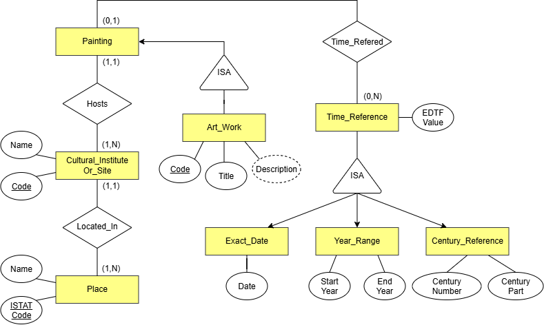

# Ontologia — Progetto SHELL, sotto-progetto dati.cultura

Questa cartella documenta il modello concettuale e l'ontologia OWL sviluppati per il sotto-progetto **dati.cultura** del progetto SHELL (rifacimento del catalogo [dati.cultura.gov.it](https://dati.cultura.gov.it/)), con particolare riferimento al dataset delle opere d'arte (dipinti) conservate in istituti e luoghi della cultura.

## Contenuto della cartella

```
ontologia/
├── README.md                         ← questo file
├── ontologia_dati_cultura.ttl        ← ontologia OWL (Turtle)
└── diagrammi/
    ├── graffoo.drawio                ← disegno graffoo, sorgente editabile
    ├── graffoo.svg                   ← disegno graffoo, per la visualizzazione
    ├── er_diagram.drawio              ← schema E-R, sorgente editabile
    └── er_diagram.svg                 ← schema E-R, per la visualizzazione
```

I file relativi alla pubblicazione dei dati (CSV, RDF/Linked Open Data, mapping YARRRML, metadati DCAT-AP_IT) si trovano nelle cartelle dedicate del repository, non qui — questa cartella riguarda solo il modello concettuale e la sua formalizzazione.

---

## 1. Il modello concettuale in breve

L'ontologia descrive quattro concetti principali:

- **`Artwork`** — opera d'arte generica, con codice identificativo, titolo e descrizione; specializzata in **`Painting`** (dipinto), l'unico sottotipo popolato in questo progetto, che porta invece le relazioni verso l'istituto e verso il riferimento temporale
- **`CulturalInstituteOrSite`** — l'istituto o luogo della cultura che ospita un dipinto
- **`Place`** — il luogo geografico (comune) in cui si trova un istituto, identificato dal codice ISTAT
- **`TimeReference`** — il riferimento temporale di un dipinto, specializzato in tre sottoclassi **mutuamente disgiunte**: **`ExactDate`** (una data AAAA-MM-DD), **`YearRange`** (un intervallo tra due anni), **`CenturyReference`** (un secolo, con numero e parte opzionale: inizio/metà/fine/prima metà/seconda metà)

Il file [`RDF_Ontologia-PM.ttl`](./RDF_Ontologia-PM.ttl) contiene la formalizzazione completa: classi, object property, datatype property, disgiunzioni, chiavi (`owl:hasKey`) e proprietà inverse (`owl:inverseOf`).

Il disegno [`Diagrammi/Graffoo_Onto-PM.drawio.png`](./Diagrammi/Graffoo_Onto-PM.drawio.png) rappresenta graficamente questo stesso modello secondo la notazione Graffoo; lo schema [`Diagrammi/DiagrammaER_Onto-PM.drawio.png`](./Diagrammi/DiagrammaER_Onto-PM.drawio.png) ne dà una lettura più semplice, orientata alla progettazione dei dati piuttosto che alla formalizzazione OWL — coerentemente con quanto indicato nel testo del progetto ("il modello può essere espresso con uno schema E/R semplificato [...] da finalizzare poi in un'ontologia"), i due diagrammi descrivono lo **stesso** modello concettuale a due livelli di formalizzazione diversi, non due modelli distinti.

### Diagramma Entity-Relation


### Graffoo


---

## 2. Competency Question

Le CQ sono state riviste più volte nel corso dello sviluppo, mano a mano che il modello si affinava -- un percorso iterativo dichiarato esplicitamente qui invece che nascosto, perché riflette il reale processo di modellazione seguito.

| # | Competency Question | Cosa giustifica nel modello |
|---|---|---|
| 1 | Qual è il codice, il titolo e la descrizione di un'opera d'arte? | `hasCode`, `hasTitle`, `hasDescription` su `Artwork` |
| 2 | In quale istituto/luogo della cultura è conservato il dipinto X? | `isHostedIn` |
| 3 | In quale luogo geografico si trova l'istituto X? | `isLocatedIn` |
| 4 | Qual è il tempo di riferimento del dipinto X, sia esso una data esatta, un intervallo di anni o un secolo? | la gerarchia `TimeReference` / `ExactDate` / `YearRange` / `CenturyReference` e la loro disgiunzione |
| 5 | Quali opere d'arte hanno un riferimento temporale compreso in un dato intervallo di anni, indipendentemente dal formato originale del dato (data esatta, intervallo o secolo)? | `hasEDTFValue` senza un valore standardizzato comune alle tre sottoclassi, una query di questo tipo richiederebbe tre logiche di confronto diverse |
| 6 | Quali dipinti sono conservati presso l'istituto X? | `hosts` (inversa di `isHostedIn`) |
| 7 | Quali istituti della cultura si trovano nel luogo geografico X? | `hasCulturalInstitute` (inversa di `isLocatedIn`) |
| 8 | Dato un codice identificativo, esiste un'unica opera d'arte (o istituto, o luogo) a cui corrisponde? | `owl:hasKey` su `Artwork`, `CulturalInstituteOrSite`, `Place` |
| 9 | Per un'opera datata genericamente a un secolo, è nota anche la parte del secolo (inizio, metà, fine, prima/seconda metà) a cui risale? | `hasCenturyPart`, distinta da `hasCenturyNumber` |
| 10 | Quali sono il codice, il titolo e la descrizione di un'opera d'arte, indipendentemente dal suo tipo specifico? | `hasCode`, `hasTitle`, `hasDescription` su `Artwork` perché sono affini su tutte le opere d'arte e non sono esclusive della classe `Painting` (ad esempio un ipotetica classe `Sculpture` |

---

## 3. Scelte di design e criticità affrontate

Questa sezione raccoglie le decisioni di modellazione più significative prese durante lo sviluppo.

#### Perché `Artwork` porta gli attributi e `Painting` porta le relazioni
Una scelta di modellazione che vale la pena spiegare esplicitamente, perché non è ovvia a prima vista: `hasCode`, `hasTitle`, `hasDescription` sono dichiarate su `Artwork` (il genitore), mentre `isHostedIn` e `hasTimeReference` sono dichiarate su `Painting` (il figlio). La logica: identificativo, titolo e descrizione sono caratteristiche di *qualunque* opera d'arte, indipendentemente dal tipo — se in futuro si aggiungesse un'altra sottoclasse (es. `Sculpture`), erediterebbe queste proprietà gratuitamente. Le relazioni con l'istituto e con il tempo di riferimento, invece, sono state derivate specificamente dallo scenario del dipinto (l'unico tipo di opera effettivamente trattato nel progetto), e quindi dichiarate al livello più specifico.

#### `Painting` come sottoclasse di `Artwork`, invece di un tipo su vocabolario controllato
Lo scenario del progetto richiede esplicitamente un'opera generica (`Artwork`) specializzata in dipinto (`Painting`). L'alternativa -- usare un'unica classe con una proprietà `dc:type`/`edm:hasType` su vocabolario controllato, come fanno EDM e DCAT-AP -- sarebbe più scalabile se il progetto dovesse rappresentare più tipi di opera in futuro (evita di dover creare una nuova classe OWL per ogni nuovo tipo), ma per un progetto che composto da solo dipinti, la sottoclasse resta la scelta più semplice e con un rado di sfida più alto dovendo definire noi le varie concettualità ontologiche.

#### `hasCode` e `hasName` con dominio "union"
`hasCode` è condiviso tra `Artwork` e `CulturalInstituteOrSite`, `hasName` tra `CulturalInstituteOrSite` e `Place`, invece di duplicare la proprietà con un nome diverso per ciascuna classe.

#### `TimeReference` specializzata in tre sottoclassi disgiunte
Il testo descrive tre modi differenti di esprimere il tempo di un'opera. La disgiunzione (`owl:AllDisjointClasses` su `ExactDate`, `YearRange`, `CenturyReference`) formalizza esattamente questo: per ogni opera esiste un solo modo di rappresentare il suo riferimento temporale nel grafo, anche se in linea di principio una data esatta "appartiene" anche a un secolo -- quella relazione resta interrogabile via query (es. sul valore EDTF), senza bisogno di duplicare il dato.

#### `hasEDTFValue` su `TimeReference`
Aggiunta per rendere possibile la CQ 5: senza un valore in un formato comune (EDTF -- Extended Date/Time Format, Library of Congress) a tutte e tre le sottoclassi, confrontare/ordinare per intervallo temporale richiederebbe tre logiche diverse (una data, due anni, un numero di secolo). È dichiarata `xsd:string` perché EDTF non ha un datatype nativo in RDF/OWL.

#### `owl:hasKey` su `Artwork`, `CulturalInstituteOrSite`, `Place`
Il testo dice esplicitamente che ciascuna di queste entità è identificata *univocamente* da un codice -- un'affermazione bidirezionale (non solo "ogni istanza ha al più un codice", ma anche "quel codice appartiene al più a un'istanza") che `owl:FunctionalProperty` da sola non copre. La chiave è dichiarata su `Artwork` (non su `Painting`) perché è lì che vive `hasCode`; per ereditarietà, si applica comunque correttamente anche alle istanze di `Painting`.

#### `hasCenturyPart` come stringa vincolata (`owl:oneOf`), non come individui
Sono stati valutati due modi di limitare `hasCenturyPart` ai soli valori ammessi durante la progettazione: un `owl:oneOf` su letterali stringa, oppure individui nominati (`:Inizio`, `:Metà`, ecc.) con `hasCenturyPart` come object property. La versione a individui (poi scartata) evita il rischio di valori scritti con maiuscole/minuscole incoerenti (in OWL letterali come `"Fine"` e `"fine"` sono valori distinti, e violerebbero l'enumerazione), ma introduce una classe e una proprietà in più. Per una mancata conoscenza adeguata in merito quindi, si è scelta la versione a stringhe, con un'unica convenzione di maiuscole (solo l'iniziale del valore, es. `"Prima metà"`) documentata esplicitamente nel file `.ttl` tramite `rdfs:comment`.

---

## 4. Come consultare l'ontologia

Il file [`RDF_Ontologia-PM.ttl`](./RDF_Ontologia-PM.ttl) si apre direttamente in [Protégé](https://protege.stanford.edu/) (File → Open). Per verificare i vincoli (chiavi, disgiunzioni) è necessario lanciare un reasoner OWL2 DL — è stato verificato con HermiT.
