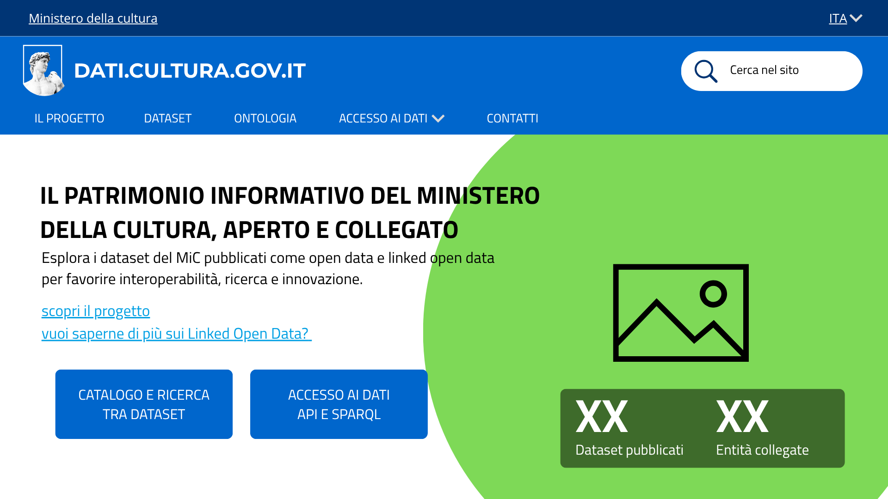
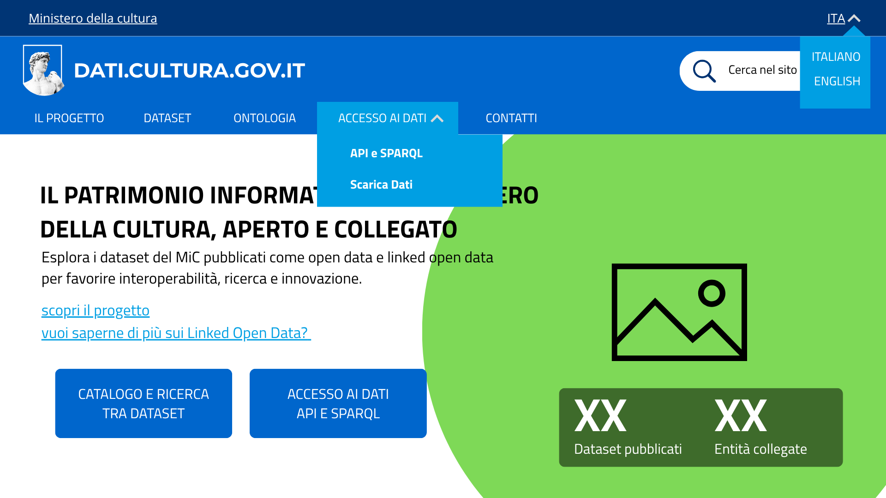

# dati.cultura.gov.it - Mockup del rifacimento del sito

Mockup a bassa fedeltà del rifacimento del catalogo open data del Ministero della Cultura ([dati.cultura.gov.it](https://dati.cultura.gov.it/)), realizzato nell'ambito del progetto SHELL (corso *Metodi informatici per la trasformazione digitale*, a.a. 2025/2026).

Le schermate qui sotto mostrano la struttura prevista per l'incremento di prodotto delle prime User Story: navigazione principale, home/landing page, catalogo dataset e sezione aggiornamenti.

--

## Contenuto della cartella
```
Mockup/
├── README.md                          ← questo file
└── Immagini/
    ├── 01-home.png                    ← home page / landing
    ├── 02-menu-dropdown.png           ← menu di navigazione, tendina aperta
    ├── 03-catalogo-dataset.png        ← catalogo dataset
    ├── 04-aggiornamenti-footer.png    ← sezione aggiornamenti e novità
    └── PM-Footer.png                  ← footer, presente su tutte le pagine
```
---

## Immagini/Screenshot

### 1. Home page / landing


La landing page introduce il progetto e il suo scopo: rendere il patrimonio informativo del MiC aperto e collegato tramite Linked Open Data. Contiene:
- **claim principale**: la frase di apertura, seguita da una breve descrizione dell'iniziativa
- **due call-to-action**: **Catalogo e ricerca tra dataset** e **Accesso ai dati (API e SPARQL)**
- **due contatori riassuntivi**: numero di **dataset pubblicati** e numero di **entità collegate**
- **due link di approfondimento**: "scopri il progetto" e "vuoi saperne di più sui Linked Open Data?"

### 2. Menu di navigazione (tendina "Accesso ai dati")


Il menu principale in testata (Il progetto, Dataset, Ontologia, Accesso ai dati, Contatti) resta sempre visibile durante lo scorrimento della pagina. La voce **Accesso ai dati** si espande in un menu a tendina con due opzioni, **API e SPARQL** e **Scarica dati**, per separare l'accesso programmatico ai dati dal download diretto dei file. In alto a destra è presente anche il selettore di lingua (ITA/ENG).

### 3. Catalogo dataset


La sezione **Dataset in evidenza** presenta i dataset pubblicati come card, ciascuna con:
- titolo del dataset
- un tag identificativo del tema o della categoria
- una breve descrizione
- il link **esplora il dataset**, per accedere alla scheda di dettaglio

Questa vista corrisponde alla pagina di ricerca/catalogo raggiungibile dalla home.

### 4. Aggiornamenti e novità


La pagina raccoglie le comunicazioni del progetto in tre colonne:
- **Nuovi dataset**: ultime pubblicazioni nel catalogo
- **Aggiornamenti**: modifiche o revisioni a dataset già pubblicati
- **Comunicazione**: annunci generali legati all'iniziativa

Ogni colonna riporta data, titolo e un link **leggi di più**, oltre alla data dell'ultima comunicazione pubblicata.

## Footer


Presente su tutte le pagine del sito: contatti istituzionali, link utili (amministrazione trasparente, privacy, note legali, accessibilità), collegamenti social.

## Note

Questo mockup rappresenta lo stato del prodotto per le User Story relative a home, navigazione e catalogo dataset. Sarà esteso negli sprint successivi, man mano che verranno completate nuove User Story (la pagina Contatti, la scheda di dettaglio dataset, la pagina Ontologia).
