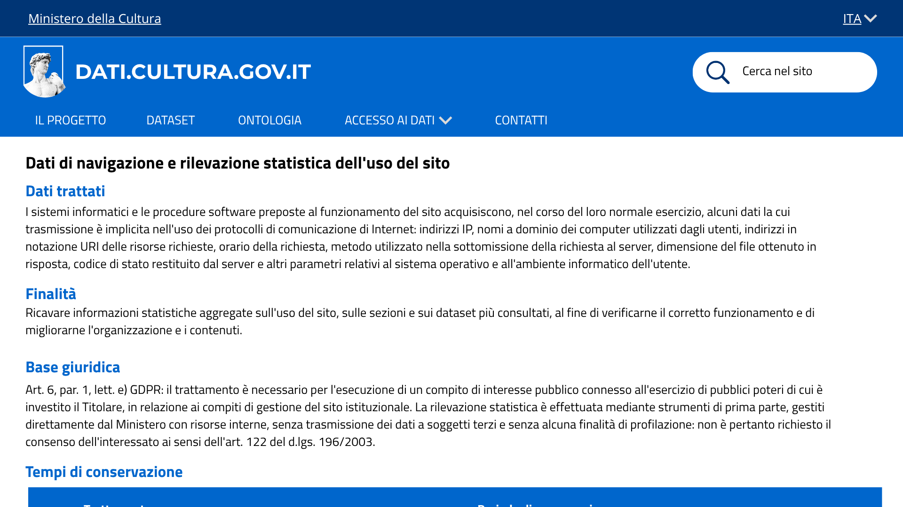

# dati.cultura.gov.it - Mockup del rifacimento del sito

Mockup a bassa fedeltà del rifacimento del catalogo open data del Ministero della Cultura ([dati.cultura.gov.it](https://dati.cultura.gov.it/)), realizzato nell'ambito del progetto SHELL (corso *Metodi informatici per la trasformazione digitale*, a.a. 2025/2026).

Le schermate mostrano la struttura prevista per l'incremento di prodotto delle prime User Story: navigazione principale, home/landing page, catalogo dataset e sezione aggiornamenti.

## Immagini/Screenshot

### 1. Home page / landing

La landing page introduce il progetto e il suo scopo (rendere il patrimonio informativo del MiC aperto e collegato tramite Linked Open Data). Contiene:

- il claim principale e una breve descrizione dell'iniziativa
- due call-to-action: **Catalogo e ricerca tra dataset** e **Accesso ai dati (API e SPARQL)**
- due contatori riassuntivi: numero di **dataset pubblicati** e numero di **entità collegate**
- i link di approfondimento "scopri il progetto" e "vuoi saperne di più sui Linked Open Data?"

### 2. Menu di navigazione (tendina "Accesso ai dati")

Il menu principale in testata (Il progetto, Dataset, Ontologia, Accesso ai dati, Contatti) è sempre visibile. La voce **Accesso ai dati** si espande in un menu a tendina con due opzioni: **API e SPARQL** e **Scarica dati**, per separare l'accesso programmatico da quello per il download diretto dei file. In alto a destra è presente anche il selettore di lingua (ITA/ENG).

### 3. Catalogo dataset

La sezione **Dataset in evidenza** presenta i dataset pubblicati sotto forma di card, ciascuna con:

- titolo del dataset
- un tag identificativo del tema/categoria
- una breve descrizione
- il link **esplora il dataset** per accedere alla scheda di dettaglio

Questa vista corrisponde alla pagina di ricerca/catalogo raggiungibile dalla home.

### 4. Aggiornamenti e novità

La pagina raccoglie le comunicazioni del progetto in tre colonne:

- **Nuovi dataset** — ultime pubblicazioni nel catalogo
- **Aggiornamenti** — modifiche o revisioni a dataset già pubblicati
- **Comunicazione** — annunci generali legati all'iniziativa

Ogni colonna riporta data, titolo e un link **leggi di più**, oltre alla data dell'ultima comunicazione pubblicata.

### 5. Informativa privacy — dati di navigazione

La sezione dell'informativa sulla privacy dedicata ai dati di navigazione (increment di Sprint 2, US2.5) è mostrata in tre schermate, corrispondenti allo scorrimento della pagina.

#### 5.1 Intestazione e dati trattati

Mostra l'intestazione dell'informativa (riferimenti normativi, data di ultimo aggiornamento) e la sezione **Dati trattati**: indirizzi IP, nomi a dominio, URI delle risorse richieste e altri parametri tecnici raccolti implicitamente dai protocolli di comunicazione di Internet.

#### 5.2 Finalità e base giuridica

Mostra la **Finalità** del trattamento (rilevazione statistica aggregata sull'uso del sito) e la **Base giuridica**: art. 6, par. 1, lett. e) GDPR — esecuzione di un compito di interesse pubblico, senza necessità di consenso ai sensi dell'art. 122 del d.lgs. 196/2003.

#### 5.3 Tempi di conservazione

Mostra la tabella dei **tempi di conservazione** (non oltre 7 giorni per i dati di navigazione) e un box di evidenza che rassicura l'utente sull'anonimizzazione delle statistiche pubblicate.

Queste schermate coprono solo la porzione di informativa relativa a US2.5

## Footer

Presente in tutte le pagine del sito, racchiude:

- **Contatti istituzionali**: indirizzo, email e PEC del Ministero della Cultura
- **Link utili**: amministrazione trasparente, informativa sulla privacy, note legali, dichiarazione di accessibilità
- **Social**: collegamenti a Facebook, Instagram, X e LinkedIn

## Note

Questo mockup rappresenta lo stato del prodotto per le US relative a home, navigazione e catalogo dataset. Verrà esteso nelle sprint successive man mano che verranno completate nuove User Story (es. pagina Contatti, scheda di dettaglio dataset, pagina Ontologia).
