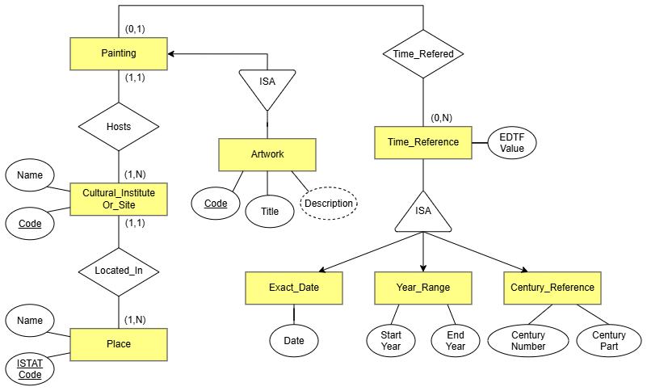
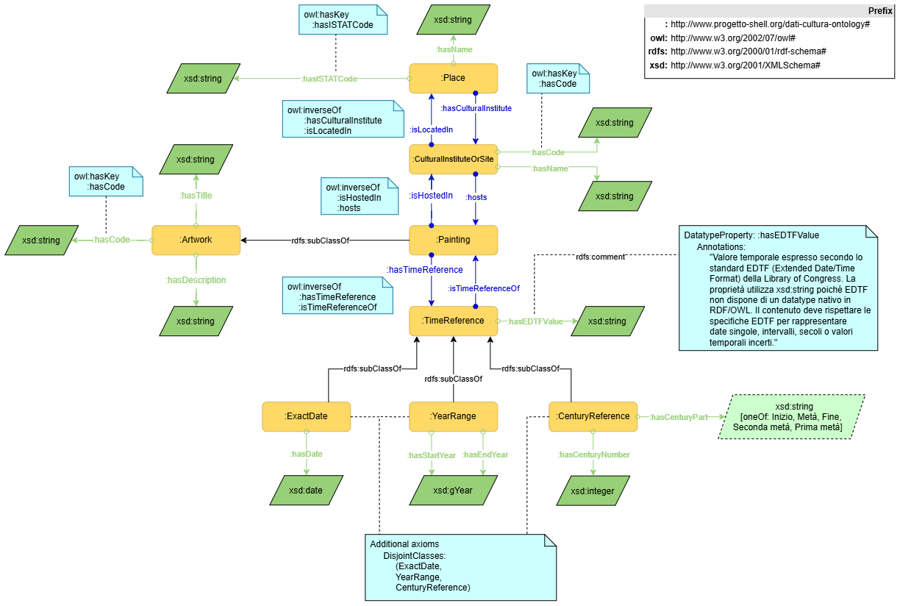

# Creazione dell'ontologia delle opere d'arte - US 2.2

Questa cartella contiene il modello concettuale e l'ontologia OWL per il dataset delle opere d'arte (dipinti) conservate in istituti e luoghi della cultura, realizzati per la User Story **US2.2 - Creazione dell'ontologia delle opere d'arte**, nell'ambito del progetto SHELL, sotto-progetto dati.cultura.

> **Come data manager, voglio che le opere d'arte e le informazioni collegate siano rappresentate secondo un modello semantico condiviso, per rendere chiari e interoperabili i dati.**

## Contenuto della cartella

```
Ontologia/
├── README.md                                  ← questo file
├── CQ_Onto-PM.txt                              ← elenco delle competency question
├── RDF_Ontologia-PM.ttl                        ← ontologia OWL (Turtle)
└── Diagrammi/
    ├── DiagrammaER_Onto-PM.drawio.png          ← schema E-R, per la visualizzazione
    ├── DiagrammaER_Onto-PM.drawio.xml          ← schema E-R, sorgente editabile
    └── Graffoo_Onto-PM.drawio.png              ← disegno Graffoo, per la visualizzazione
```
---

## 1. Il modello concettuale in breve

L'ontologia descrive quattro concetti principali:

- **`Artwork`**: opera d'arte generica, con codice identificativo, titolo e descrizione. Si specializza in **`Painting`** (dipinto), l'unico sottotipo popolato in questo progetto, che porta le relazioni verso l'istituto e verso il riferimento temporale.
- **`CulturalInstituteOrSite`**: l'istituto o luogo della cultura che ospita un dipinto.
- **`Place`**: il luogo geografico (comune) in cui si trova un istituto, identificato dal codice ISTAT.
- **`TimeReference`**: il riferimento temporale di un dipinto, specializzato in tre sottoclassi **mutuamente disgiunte**: **`ExactDate`** (una data AAAA-MM-DD), **`YearRange`** (un intervallo tra due anni), **`CenturyReference`** (un secolo, con numero e parte opzionale: inizio, metà, fine, prima metà, seconda metà).

Le relazioni principali: un dipinto **è ospitato in** un istituto (`isHostedIn`, e viceversa **ospita**, `hosts`); un istituto **si trova in** un luogo (`isLocatedIn`, e viceversa **ha istituto**, `hasCulturalInstitute`); un dipinto **ha un riferimento temporale** (`hasTimeReference`). Quest'ultima, a differenza delle prime due, non è dichiarata funzionale nella direzione inversa: uno stesso riferimento temporale può essere condiviso da più dipinti quando il valore coincide, coerente con la cardinalità (0,N) nello schema E-R.

Il file [`RDF_Ontologia-PM.ttl`](./RDF_Ontologia-PM.ttl) contiene la formalizzazione completa: classi, object property, datatype property, disgiunzioni, chiavi (`owl:hasKey`) e proprietà inverse (`owl:inverseOf`).

Il disegno [`Diagrammi/Graffoo_Onto-PM.drawio.png`](./Diagrammi/Graffoo_Onto-PM.drawio.png) rappresenta graficamente questo modello secondo la notazione Graffoo. Lo schema [`Diagrammi/DiagrammaER_Onto-PM.drawio.png`](./Diagrammi/DiagrammaER_Onto-PM.drawio.png) ne dà una lettura più semplice, orientata alla progettazione dei dati piuttosto che alla formalizzazione OWL. Coerentemente con quanto indicato nel testo del progetto ("il modello può essere espresso con uno schema E/R semplificato [...] da finalizzare poi in un'ontologia"), i due diagrammi descrivono lo **stesso** modello concettuale a due livelli di formalizzazione diversi, non due modelli distinti.

### Diagramma Entity-Relation


### Graffoo


---

## 2. Competency question

Il file [`CQ_Onto-PM.txt`](CQ_Onto-PM.txt) elenca le domande a cui l'ontologia deve saper rispondere. Sono state riviste più volte durante lo sviluppo, mano a mano che il modello si affinava: un percorso iterativo dichiarato esplicitamente qui invece che nascosto, perché riflette il reale processo di modellazione seguito.

| # | Competency question | Cosa giustifica nel modello |
|---|---|---|
| 1 | Qual è il codice, il titolo e la descrizione di un'opera d'arte? | `hasCode`, `hasTitle`, `hasDescription` su `Artwork` |
| 2 | In quale istituto/luogo della cultura è conservato il dipinto X? | `isHostedIn` |
| 3 | In quale luogo geografico si trova l'istituto X? | `isLocatedIn` |
| 4 | Qual è il tempo di riferimento del dipinto X, sia esso una data esatta, un intervallo di anni o un secolo? | la gerarchia `TimeReference` / `ExactDate` / `YearRange` / `CenturyReference` e la loro disgiunzione |
| 5 | Quali opere d'arte hanno un riferimento temporale compreso in un dato intervallo di anni, indipendentemente dal formato originale del dato? | `hasEDTFValue`: senza un valore standardizzato comune alle tre sottoclassi, una query di questo tipo richiederebbe tre logiche di confronto diverse |
| 6 | Quali dipinti sono conservati presso l'istituto X? | `hosts` (inversa di `isHostedIn`) |
| 7 | Quali istituti della cultura si trovano nel luogo geografico X? | `hasCulturalInstitute` (inversa di `isLocatedIn`) |
| 8 | Dato un codice identificativo, esiste un'unica opera d'arte (o istituto, o luogo) a cui corrisponde? | `owl:hasKey` su `Artwork`, `CulturalInstituteOrSite`, `Place` |
| 9 | Per un'opera datata genericamente a un secolo, è nota anche la parte del secolo a cui risale? | `hasCenturyPart`, distinta da `hasCenturyNumber` |
| 10 | Quali sono il codice, il titolo e la descrizione di un'opera d'arte, indipendentemente dal suo tipo specifico? | `hasCode`, `hasTitle`, `hasDescription` su `Artwork`, perché sono comuni a tutte le opere d'arte e non esclusive della classe `Painting` |

> ⚠️ Verificare che la CQ6 sia effettivamente presente nel file `CQ_Onto-PM.txt`: in una trascrizione precedente della lista, l'elenco saltava da CQ5 a CQ7.

---

## 3. Scelte di design e criticità affrontate

Questa sezione riassume le principali decisioni di modellazione prese durante lo sviluppo dell'ontologia, con particolare attenzione alle esigenze reali del dataset fornito.

#### `Artwork` vs `Painting`: attributi generali e relazioni specifiche
Gli attributi comuni (`hasCode`, `hasTitle`, `hasDescription`) sono stati collocati su `Artwork` perché rappresentano caratteristiche condivise da qualunque opera d'arte. Le relazioni (`isHostedIn`, `hasTimeReference`) sono invece su `Painting` perché derivano direttamente dal contenuto del CSV, che contiene solo dipinti. Altri tipi di opere (come sculture o opere digitali) potrebbero non avere le stesse relazioni, quindi abbiamo modellato solo ciò che era realmente presente nei dati.

#### `Painting` come sottoclasse, non come tipo controllato
Abbiamo scelto `Painting` come sottoclasse di `Artwork` perché il dataset contiene esclusivamente dipinti. Un approccio alternativo (una singola classe con un tipo controllato, come in DCAT-AP o EDM) sarebbe più flessibile in un contesto con molti tipi diversi di opere, ma per questo progetto la sottoclasse è la soluzione più semplice e coerente con i dati disponibili.

#### `hasCode` e `hasName` con dominio "union"
Le proprietà `hasCode` e `hasName` sono condivise tra più classi tramite `owl:unionOf`, evitando duplicazioni inutili. Questa scelta mantiene il modello più pulito e riduce la ripetizione di proprietà equivalenti.

#### TimeReference suddiviso in tre sottoclassi disgiunte
Il dataset assegna a ogni dipinto un solo tipo di riferimento temporale: data esatta, intervallo di anni o secolo. Per riflettere questa struttura, `ExactDate`, `YearRange` e `CenturyReference` sono state rese disgiunte. Avevamo considerato anche la possibilità di ricavare automaticamente il secolo dalle date per uniformare i valori, ma l'idea è stata scartata per non introdurre logiche aggiuntive non richieste dal progetto.

#### `hasEDTFValue` per uniformare il confronto temporale
`hasEDTFValue` è stato aggiunto a `TimeReference` per fornire un valore temporale uniforme (EDTF) indipendentemente dal tipo di riferimento. Senza questa proprietà, confrontare date, intervalli e secoli richiederebbe tre logiche diverse. Il datatype è `xsd:string` perché EDTF non ha un tipo nativo in OWL.

#### Chiavi (`owl:hasKey`) per garantire l'univocità dei codici
Il progetto richiede che ogni codice identifichi uno e un solo soggetto (opera, istituto o luogo). Per questo motivo, `owl:hasKey` è stato dichiarato su `Artwork`, `CulturalInstituteOrSite` e `Place`, in modo da garantire l'univocità globale dei codici presenti nel dataset.

#### `hasCenturyPart` come stringa vincolata
I valori ammessi per `hasCenturyPart` sono stati modellati come stringhe vincolate tramite `owl:oneOf`. L'alternativa (usare individui dedicati) avrebbe evitato problemi di maiuscole/minuscole, ma avrebbe introdotto una classe e una proprietà aggiuntiva. Per semplicità è stata scelta la versione a stringhe, con una convenzione documentata nel file [`RDF_Ontologia-PM.ttl`](./RDF_Ontologia-PM.ttl).

#### Fonti per la costruzione dei diagrammi e del Graffoo
Alcune situazioni incontrate durante il lavoro non erano state trattate a lezione: per queste sono stati usati due riferimenti esterni.
- [Per la costruzione del Graffoo](https://essepuntato.it/graffoo/specification/)
- [Per la costruzione del diagramma E-R](https://www.slideserve.com/kaelem/progettazione-concettuale-il-modello-entit-relazioni)

---

## 4. Come consultare l'ontologia

Il file [`RDF_Ontologia-PM.ttl`](./RDF_Ontologia-PM.ttl) si apre direttamente in [Protégé](https://protege.stanford.edu/) (File → Open). Per verificare i vincoli (chiavi, disgiunzioni) è necessario lanciare un reasoner OWL2 DL: è stato verificato con HermiT.

---

## 5. Copertura del test di accettazione

| Requisito | Verifica | Esito |
|---|---|---|
| Risponde ad almeno 5 competency question (minimo richiesto: 3) | 10 CQ documentate, ciascuna con una giustificazione precisa nel modello (sezione 2) | ✅ |
| È disegnata in Graffoo | [`Graffoo_Onto-PM.drawio.png`](Diagrammi/Graffoo_Onto-PM.drawio.png) | ✅ |

---

## 6. Deliverable

- Disegno Graffoo (`Diagrammi/Graffoo_Onto-PM.drawio.png`)
- Disegno diagramma E-R (`Diagrammi/DiagrammaER_Onto-PM.drawio.png`)
- Elenco delle competency question (`CQ_Onto-PM.txt`)
- Ontologia in RDF/Turtle (`RDF_Ontologia-PM.ttl`)

---

## 7. Relazione con altre User Story

Questa cartella fa parte dell'epic **Semantica e ontologie** (PM-3). Il disegno Graffoo assolve la funzione di artefatto visuale di questa US: la pagina che lo espone in forma divulgativa al pubblico del sito è prodotta separatamente nella **US1.3** (Sprint 2). Le competency question qui elencate sono inoltre la base delle query SPARQL di esempio documentate in **US1.4**.
