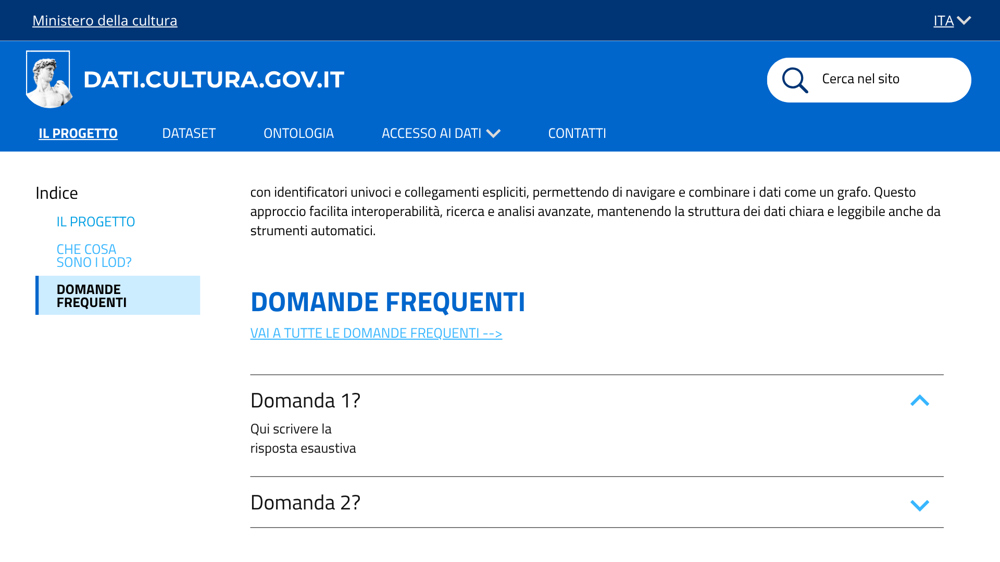

# Sezione FAQ  - US 1.10

Questa cartella documenta il mockup della sezione **Domande frequenti**, realizzato per la User Story **US1.10 - Sezione FAQ (domande frequenti)**, nell'ambito del progetto SHELL, sotto-progetto dati.cultura.

> **Come ricercatrice e data journalist, voglio trovare in un'unica sezione le risposte alle domande più frequenti sull'uso del catalogo, per orientarmi e far orientare i miei collaboratori senza dover cercare le informazioni sparse tra le varie pagine.**

## Contenuto della cartella

```
Mockup/DomandeFrequenti/
├── README.md                  ← questo file
└── Immagini/
    ├── ilProgetto_QnA.png     ← sezione FAQ, 
    └── ilProgetto_QnAext.png  
```
---

## 1. La sezione FAQ


La pagina si apre dallo stesso indice laterale della sezione "Il progetto", con una terza voce "Domande frequenti". Mostra tre domande a blocchi: si vede solo la domanda, e cliccandoci sopra compare la risposta.


Qui vediamo la prima domanda aperta, per mostrare come si presenta la risposta una volta espansa.

Il testo però non è ancora quello vero. Al posto delle domande c'è scritto solo "Domanda 1?", "Domanda 2?", "Domanda 3?", e al posto della risposta c'è scritto "Qui scrivere la risposta esaustiva". La struttura della pagina funziona ma bisogna scrivere le domande vere e le loro risposte.

---

## 2. Copertura del test di accettazione

| Requisito | Verifica |
|---|---|
| Esiste una sezione FAQ raggiungibile dalla navigazione | Voce "Domande frequenti" nell'indice laterale |
| Contiene almeno 3 domande con relativa risposta | 3 blocchi presenti |

---

## 3. Deliverable

- Mockup della sezione Domande frequenti, due schermate (`Immagini/`)

---

## 4. Relazione con altre User Story

Questa cartella fa parte dell'epic **Home page e presentazione dell'iniziativa** (PM-1), la stessa di **US1.9**. 
