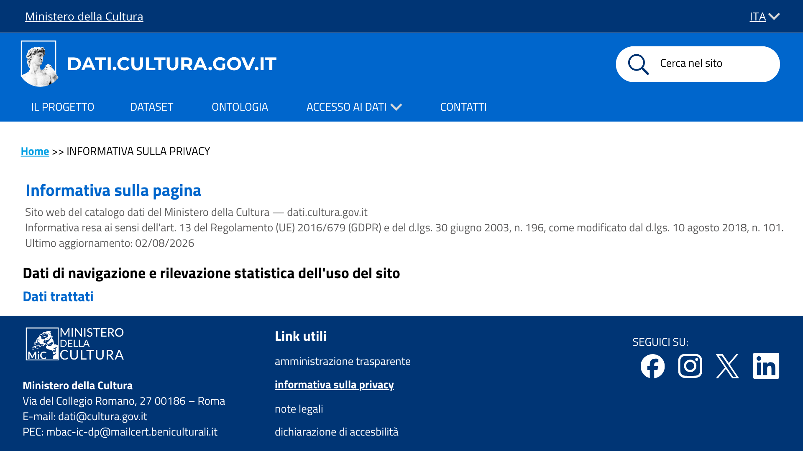
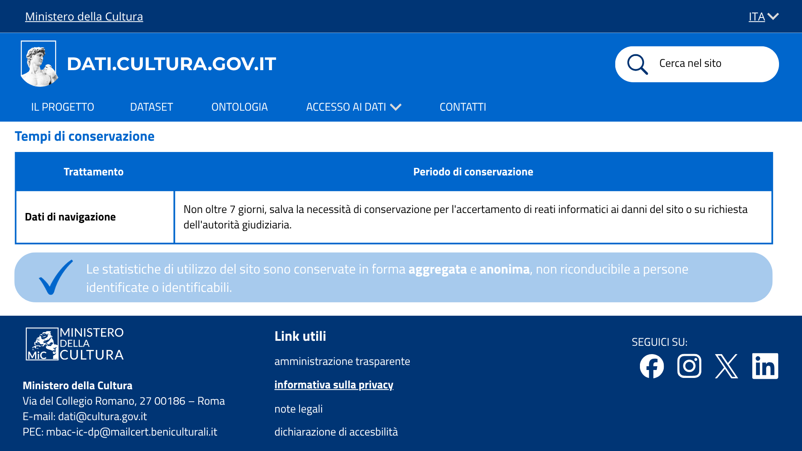

# Informativa privacy - dati di navigazione - US 2.5

Questa cartella documenta il mockup della sezione dell'informativa sulla privacy dedicata ai dati di navigazione, realizzato per la User Story **US2.5 - Informativa privacy: tracciamento del sito**, nell'ambito del progetto SHELL, sotto-progetto dati.cultura.

> **Come titolare del trattamento, voglio informare gli utenti su come vengono trattati i dati di navigazione, indicando finalità, tempi di conservazione e base giuridica, per garantire trasparenza e conformità alla normativa.**

## Contenuto della cartella

```
Mockup/Privacy/
├── README.md                                    ← questo file
└── Immagini/
    ├── 05-privacy-dati-navigazione.png          ← intestazione e dati trattati
    ├── 05.1-privacy-dati-navigazione.png        ← finalità e base giuridica
    └── 05.2-privacy-dati-navigazione.png        ← tempi di conservazione
```

---

## 1. Le tre schermate

Tre schermate mostrano la sezione dell'informativa privacy sui dati di navigazione, nell'ordine in cui si vedono scorrendo la pagina.

### 1.1 Intestazione e dati trattati


Mostra l'intestazione dell'informativa (riferimenti normativi, data di ultimo aggiornamento) e la sezione **Dati trattati**: indirizzi IP, nomi a dominio, URI delle risorse richieste e altri parametri tecnici raccolti implicitamente dai protocolli di comunicazione di Internet.

### 1.2 Finalità e base giuridica


Mostra la **Finalità** del trattamento (rilevazione statistica aggregata sull'uso del sito) e la **Base giuridica**: art. 6, par. 1, lett. e) GDPR, esecuzione di un compito di interesse pubblico, senza necessità di consenso ai sensi dell'art. 122 del d.lgs. 196/2003.

### 1.3 Tempi di conservazione


Mostra la tabella dei **tempi di conservazione** (non oltre 7 giorni per i dati di navigazione) e un box di evidenza che rassicura l'utente sull'anonimità delle statistiche pubblicate.

---

## 2. Copertura del test di accettazione

| Requisito | Dove è soddisfatto |
|---|---|
| La sezione indica finalità, base giuridica e tempi di conservazione per il trattamento dei dati di navigazione | Schermate 1.2 (finalità e base giuridica) e 1.3 (tempi di conservazione) |
| La base giuridica è motivata con riferimento all'art. 6 GDPR e alla natura pubblica del titolare | Schermata 1.2, e approfondita nella nota di motivazione in [`Privacy/`](../../Privacy/) |
| Mockup: pagina informativa, sezione dati di navigazione v1 | Cartella `Immagini/`, tre schermate |

---

## 3. Deliverable

- Mockup della sezione "tracciamento navigazione" dell'informativa privacy, tre schermate (`Immagini/`)
- Nota di motivazione della base giuridica, in [`Privacy/`](../../Privacy/)
---

## 4. Relazione con altre User Story

US2.5 fa parte della stessa epic di US3.1-US3.4 (Privacy e protezione dei dati personali), ma riguarda una cosa diversa: qui si tratta dei dati di navigazione raccolti automaticamente dal sito, mentre le altre riguardano i messaggi che gli utenti inviano dalla pagina Contatti.

