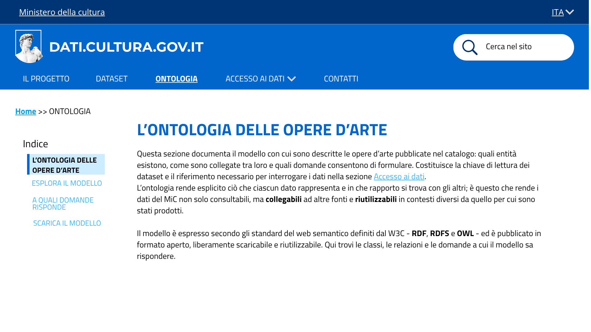
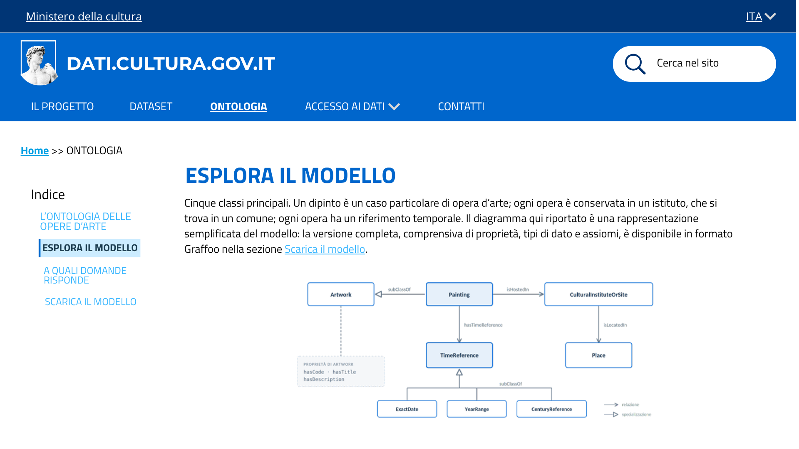

# Consultare il modello semantico - US 1.3

Questa cartella documenta il mockup della pagina **Ontologia**, realizzato per la User Story **US1.3 - Consultare il modello semantico**, nell'ambito del progetto SHELL, sotto-progetto dati.cultura.

> **Come ricercatrice, voglio comprendere come sono strutturati e collegati i dati sulle opere d'arte, per poterli interpretare correttamente e formulare interrogazioni sui dati.**

La pagina espone in forma divulgativa il modello concettuale formalizzato nella US2.2 (Sprint 1). Non produce dati nuovi: riusa il diagramma Graffoo e le competency question già prodotti.

## Contenuto della cartella

```
Mockup/Semantica/
├── README.md                          ← questo file
└── Immagini/
    ├── 06-ontologia-intro.png         ← L'ontologia delle opere d'arte
    ├── 07-ontologia-esplora.png       ← Esplora il modello
    ├── 08-ontologia-legenda.png       ← Legenda delle classi
    ├── 09-ontologia-domande.png       ← A quali domande risponde
    └── 10-ontologia-scarica.png       ← Scarica il modello
```

---

## 1. Struttura della pagina

La pagina è organizzata in quattro sezioni, navigabili da un indice laterale sempre visibile:

| Sezione | Contenuto |
|---|---|
| **L'ontologia delle opere d'arte** | Che cosa documenta la sezione, perché il modello è la chiave di lettura dei dataset, riferimento agli standard W3C (RDF, RDFS, OWL) |
| **Esplora il modello** | Diagramma semplificato delle cinque classi, legenda con identificativo di ciascuna classe, approfondimento sul trattamento del tempo |
| **A quali domande risponde** | Tre domande scritte in linguaggio naturale, mostrate come blocchi a scomparsa: si vede solo la domanda, e cliccandoci sopra compare la risposta con un esempio sui dati pubblicati. |
| **Scarica il modello** | Ontologia in RDF/Turtle, diagramma Graffoo in PNG, PDF delle dieci competency question |

La scelta di articolare la pagina in sezioni brevi con indice risponde al requisito di progetto di **ridurre il testo** rispetto al sito attuale: ogni sezione è autonoma e raggiungibile direttamente, senza obbligare a una lettura sequenziale.

---

## 2. Schermate

### 2.1 L'ontologia delle opere d'arte


Testo di apertura con il rimando alla sezione *Accesso ai dati*, che collega la comprensione del modello alla sua interrogazione pratica (US1.4).

### 2.2 Esplora il modello


Cinque classi principali. Un dipinto è un caso particolare di opera d'arte, da cui eredita codice, titolo e descrizione; ogni dipinto è conservato in un istituto, che si trova in un comune, e ha un riferimento temporale che può assumere tre forme. Il diagramma qui riportato è una rappresentazione semplificata del modello: la versione completa, comprensiva di proprietà, tipi di dato e assiomi, è disponibile in formato Graffoo nella sezione Scarica il modello.

Diagramma semplificato: `Painting` come sottoclasse di `Artwork`, da cui eredita codice, titolo e descrizione; la catena `Painting` → `CulturalInstituteOrSite` → `Place`; il ramo `TimeReference` con le tre sottoclassi `ExactDate`, `YearRange` e `CenturyReference`.

### 2.3 Legenda delle classi


La sezione presenta la struttura dell'ontologia in forma tabellare: per ciascuna classe sono indicati che cosa rappresenta e da quale proprietà è identificata univocamente. Le cinque classi principali (`Artwork`, `Painting`, `CulturalInstituteOrSite`, `Place`, `TimeReference`) sono seguite dalle tre sottoclassi di `TimeReference`. `Artwork` porta le proprietà descrittive comuni a qualunque opera d'arte (codice identificativo, titolo, descrizione), mentre `Painting` è la classe da cui partono le relazioni verso l'istituto conservatore e verso il riferimento temporale.

Il tempo viene trattato come entità autonoma anziché come valore testuale: nelle fonti di catalogazione la datazione compare in forme eterogenee (date complete, intervalli di anni, riferimenti di secolo con eventuali specificazioni di parte) che una singola proprietà testuale non consentirebbe di confrontare. Alle tre sottoclassi si affianca un valore espresso secondo lo standard EDTF, destinato all'interoperabilità con sistemi esterni.

### 2.4 A quali domande risponde


Le domande esposte sul sito sono riformulazioni divulgative delle competency question prodotte nella US2.2. La forma originale, con la variabile `X`, è corretta come artefatto di progettazione ma risulta incomprensibile a un visitatore: sul sito le domande sono quindi poste come le formulerebbe davvero l'utente, mentre l'elenco integrale in forma originale resta disponibile nel PDF scaricabile.

Le tre domande, nel loro insieme, percorrono ogni arco del diagramma semplificato: la specializzazione `Painting`/`Artwork` con le proprietà identificative, le relazioni `isHostedIn` e `isLocatedIn` con le rispettive inverse, e il ramo `hasTimeReference` con le tre sottoclassi.

### 2.5 Scarica il modello


Tre card di download (TTL, PNG, PDF) con formato e dimensione dichiarati, coerenti con il principio di pubblicazione in formato aperto e riutilizzabile.

---

## 3. Copertura del test di accettazione

| Requisito | Dove è soddisfatto |
|---|---|
| Diagramma dell'ontologia con `Artwork`, `Painting`, `CulturalInstituteOrSite`, `Place`, `TimeReference` | Sezione *Esplora il modello* |
| Legenda delle classi | Sezione *Esplora il modello*, tabella |
| Almeno 3 competency question documentate | Sezione *A quali domande risponde* (3 domande), più il PDF con le dieci CQ in *Scarica il modello* |
| Mockup della pagina Semantica | Cartella `Immagini/` |
| Dati/documenti: nessuno, riuso del Graffoo e delle CQ prodotti in US2.2 | Nessun nuovo artefatto di dati prodotto |

---

## 4. Deliverable

- Mockup della pagina Ontologia, cinque schermate (`Immagini/`)
- Testi definitivi delle tre domande e delle relative risposte (sezione 2.4 di questo documento)

Nessun nuovo dato o documento: il diagramma Graffoo e le competency question sono riusati dalla US2.2 (Sprint 1).

---

## 5. Relazione con altre User Story

- **US2.2 (Sprint 1)**: fornisce l'ontologia OWL, il diagramma Graffoo e le dieci competency question riusate in questa pagina.
- **US1.4**: la pagina *Accesso ai dati* espone le query SPARQL di esempio, derivate dalle stesse competency question. La separazione è voluta: la pagina Ontologia spiega **che cosa** il modello permette di sapere, la pagina Accesso ai dati mostra **come** interrogarlo. Le query non sono quindi duplicate in questa US, dove il campo Dati/documenti è esplicitamente vuoto.
