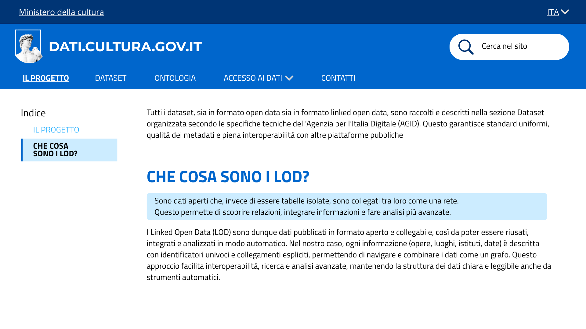

# Il progetto - US 1.9

Questa cartella documenta il mockup della sezione **Il progetto**, realizzato per la User Story **US1.9 - Il progetto dati.cultura.gov.it**, nell'ambito del progetto SHELL, sotto-progetto dati.cultura.

> **Come ricercatrice, voglio che i dettagli dell'iniziativa siano leggibili, in modo che i miei borsisti e assegnisti di studi umanistici possano comprendere i LOD e il progetto stesso.**

La sezione spiega in modo breve ma esaustivo la nascita e le finalità del progetto, anche a chi non ha familiarità con i Linked Open Data (LOD). È organizzata in due parti, navigabili dall'indice laterale.

## Contenuto della cartella

```
Mockup/ilProgetto/
├── README.md                      ← questo file
└── Immagini/
    ├── ilProgetto_head.png        ← Il progetto
    └── ilProgetto_LOD.png         ← Cosa sono i LOD
```

---

## 1. Le due sezioni

L'indice laterale della pagina mostra due voci: **Il progetto** e **Che cosa sono i LOD?**.

### 1.1 Il progetto


Presenta dati.cultura.gov.it come la piattaforma con cui il Ministero della Cultura pubblica i propri dati in forma aperta, seguendo l'approccio dei Linked Open Data. L'obiettivo non è solo rendere i dati consultabili, ma anche **collegabili**, **interoperabili** e **riutilizzabili** da cittadini, ricercatori e sviluppatori.

Spiega poi che i primi dataset pubblicati come LOD nascono dal lavoro congiunto tra istituti centrali e direzioni generali del Ministero, mettendo in relazione informazioni che prima stavano in quattro sistemi separati:
- la banca dati dei luoghi della cultura
- le anagrafiche di archivi e biblioteche
- il catalogo dei beni culturali
- altre banche dati documentali e fotografiche gestite dal MiC

Chiude con un rimando alla sezione **Dataset**, dove tutti i dataset (sia open data sia linked open data) sono organizzati secondo le specifiche tecniche dell'Agenzia per l'Italia Digitale (AGID): questo garantisce standard uniformi, qualità dei metadati e interoperabilità con altre piattaforme pubbliche.

### 1.2 Cosa sono i LOD


Dopo aver ripreso il rimando alla sezione Dataset, la pagina risponde alla domanda **"Che cosa sono i LOD?"**, su due livelli:

- **Un riquadro in evidenza**, con una spiegazione semplice.
- **Un paragrafo di approfondimento**, più tecnico: i Linked Open Data sono dati pubblicati in formato aperto e collegabile, così da poter essere riusati, integrati e analizzati in automatico. Nel progetto, questo significa che ogni informazione (opere, luoghi, istituti, date) ha un identificatore univoco e collegamenti espliciti verso le altre, così i dati si possono navigare e combinare come un grafo.

---

## 2. Copertura del test di accettazione

| Requisito | Dove è soddisfatto |
|---|---|
| La sezione descrive in modo esaustivo ma sintetico il progetto | Sotto-sezione *Il progetto* |
| La sezione contiene una spiegazione di cosa siano i LOD | Sotto-sezione *Cosa sono i LOD* |

---

## 3. Deliverable

- Mockup della sezione Il progetto, due schermate (`Immagini/`)

---

## 4. Relazione con altre User Story

La sezione Il progetto fa parte dell'epic **Home page e presentazione dell'iniziativa** (PM-1), e rimanda alla sezione Dataset per chi vuole passare dalla presentazione generale alla consultazione dei dati veri e propri.
