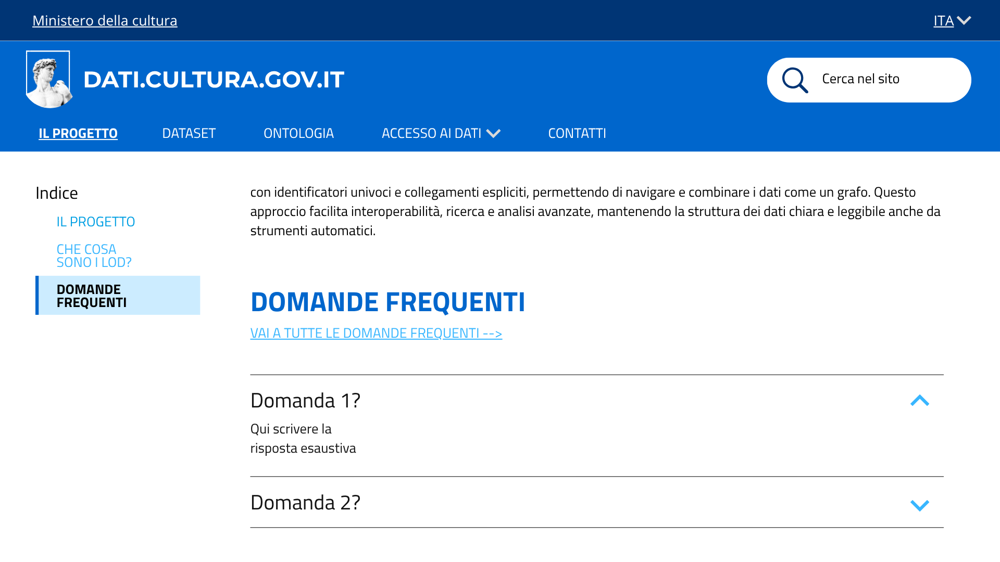
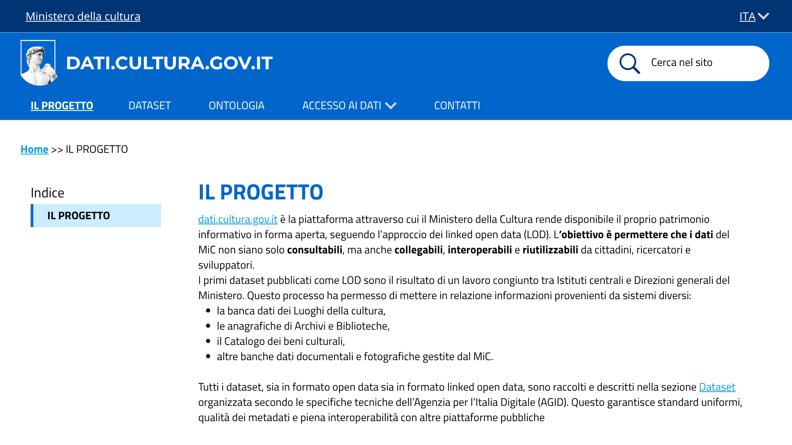
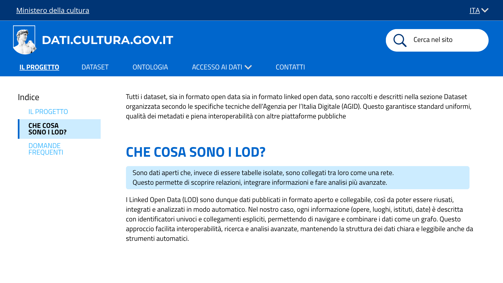

# dati.cultura.gov.it - Mockup del rifacimento del sito

## Immagini/Screenshot

### 1. Sezione IL PROGETTO - spiegazioni e domande

La sezione IL PROGETTO spiega all'utente, in maniera breve ma esaustiva, la nascita e le finalità del progetto, anche per chi non avvezzo ai LOD. Essa è divisa a sua volta in tre sezioni

#### 1.1 IL PROGETTO

all'utente, in maniera breve ma esaustiva, la nascita e le finalità del progetto, rimandando alla sezione dataset.

#### 1.2 COSA SONO I LOAD?

Spiega ai neofiti cosa significa un dato LOD. La spiegazione sintetica e non tecnica è inserita dentro un riquadro per saltare subito all'occchio. Successivamente si spiega con un gergo più adeguato, la loro funzione.

#### 1.3 DOMANDE FREQUENTI

Sono inserite le domande più frequenti poste dagli utenti, con la possibilità di andare in una sezione apposita da sviluppare. Nonostante non sia, magari, conforme al metodo SCRUM in quanto è inserita un link che non sarà sviluppato, è attinente.

## Note

Questo mockup rappresenta lo stato del prodotto per le US relative alla descrizione del progetto. Verrà esteso nelle sprint successive man mano che verranno completate nuove User Story (es. pagina Contatti, scheda di dettaglio dataset, pagina Ontologia).

