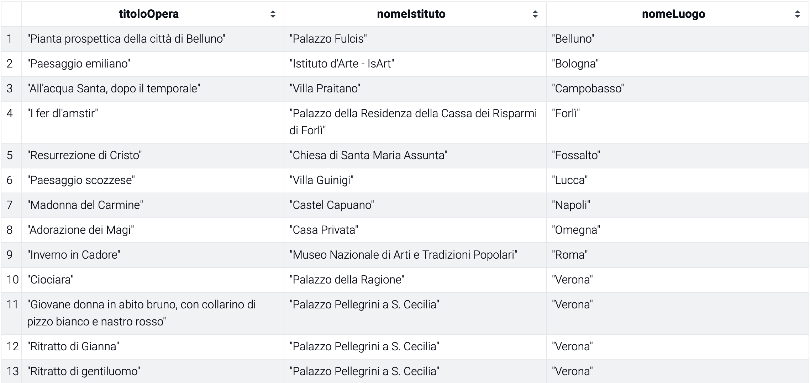
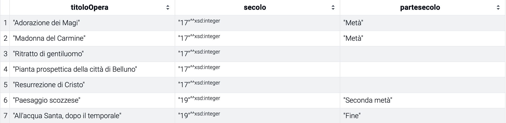

# Accesso ai dati — SPARQL endpoint e query di esempio
Questa cartella documenta l'accesso al dataset RDF delle opere d'arte tramite endpoint SPARQL,
realizzato per la User Story **US1.4 — Accesso ai dati via API/SPARQL con esempi pronti**.

L'obiettivo è permettere a chi consulta i dati di interrogare il dataset senza dover costruire 
tutto da capo, con *query* pronte all'uso e un *endpoint* funzionante generato da GraphDB.

---

## 1. Endpoint SPARQL
I dati (ontologia + istanze) sono stati caricati sulla versione gratuita per computer di GraphDB
(Ontotext), uno dei triple store visti a lezione. Il repository creato si chiama *dati-cultura*
e contiene **337 statement** (ontologia + dati dei dipinti, istituti e luoghi).

**Endpoint SPARQL (query):**
http://localhost:7200/repositories/dati-cultura
> Nota: l'endpoint funziona solo in locale, sul computer di chi lo esegue.

---

## 2. Query di esempio
> **Nota**: prefisso comune a tutte le query
```PREFIX dco: <http://www.progetto-shell.org/dati-cultura-ontology#>```

### Query 1 — Catena dipinto → istituto → luogo (CQ 2, 3, 6, 7)
> CQ2: "In quale istituto/luogo della cultura è conservato il dipinto X?"
> CQ3: "In quale luogo geografico si trova l'istituto X?"
> CQ6: "Quali dipinti sono conservati presso l'istituto X?"
> CQ7: "Quali istituti della cultura si trovano nel luogo geografico X?"
```
SELECT ?titoloOpera ?nomeIstituto ?nomeLuogo 
WHERE { 
?opera a dco:Painting ; dco:hasTitle 
?titoloOpera ; dco:isHostedIn ?istituto . 
?istituto dco:hasName ?nomeIstituto ; dco:isLocatedIn ?luogo . 
?luogo dco:hasName ?nomeLuogo . 
} 
ORDER BY ?nomeLuogo ?titoloOpera
```

> **Risultato verificato**: 13 righe, una per ciascun dipinto del dataset, con istituto e luogo
correttamente collegati (es. "Adorazione dei Magi" → "Casa Privata" → "Omegna").

### Query 2 — Dipinti datati per intervallo di secoli (CQ 4, 5, 9)
> CQ4: "Qual è il tempo di riferimento del dipinto X, sia esso una data esatta, un intervallo di anni o un secolo?"
> CQ5: "Quali opere d'arte hanno un riferimento temporale compreso in un dato intervallo di anni, indipendentemente dal formato originale del dato?"
> CQ9: "Per un'opera datata genericamente a un secolo, è nota anche la parte del secolo a cui risale?"
```sparql
SELECT ?titoloOpera ?secolo ?partesecolo
WHERE {
  ?opera a dco:Painting ;
         dco:hasTitle ?titoloOpera ;
         dco:hasTimeReference ?tempo .
  ?tempo a dco:CenturyReference ;
         dco:hasCenturyNumber ?secolo .
  OPTIONAL { ?tempo dco:hasCenturyPart ?partesecolo }
  FILTER (?secolo >= 17 && ?secolo <= 19)
}
ORDER BY ?secolo
```

> **Risultato verificato**: 7 righe (5 dipinti del XVII secolo, 2 del XIX secolo); i dipinti
datati al XX secolo sono correttamente esclusi dal filtro.

---
