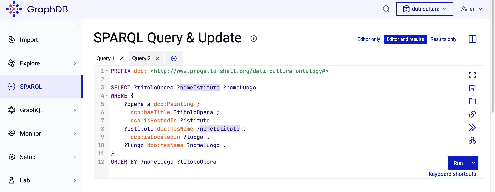
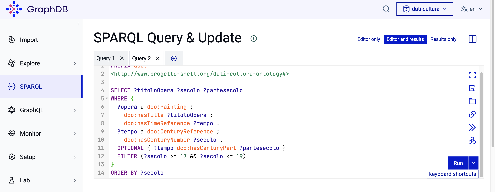

 # Accesso ai dati via API/SPARQL con esempi pronti - US 1.4

Questa cartella documenta l'accesso al dataset RDF delle opere d'arte tramite endpoint SPARQL, realizzato per la User Story **US1.4 - Accesso ai dati via API/SPARQL con esempi pronti**, nell'ambito del progetto SHELL, sotto-progetto dati.cultura.

> **Come ricercatrice e data journalist, voglio avere esempi pronti per interrogare i dati e un accesso diretto al servizio, per iniziare a consultarli senza dover costruire tutto da zero.**

L'obiettivo è permettere a chi consulta i dati di interrogare il dataset senza dover costruire tutto da capo, con query pronte all'uso e un endpoint funzionante generato da GraphDB.

## Contenuto della cartella

```
SPARQL/
├── README.md                          ← questo file
└── Immagini/
    ├── query1-.png                    ← Query 1, editor GraphDB
    ├── query1-risultati.png           ← Query 1, tabella dei risultati
    ├── query2-.png                    ← Query 2, editor GraphDB
    ├── query2-risultati.png           ← Query 2, tabella dei risultati
    └── esempio-risposta-api.srx       ← risposta salvata della chiamata API di esempio
```

---

## 1. Endpoint SPARQL

I dati (ontologia + istanze) sono stati caricati sulla versione gratuita per computer di GraphDB, uno dei triple store visti a lezione. Il repository creato si chiama *dati-cultura* e contiene **337 statement** (ontologia + dati dei dipinti, istituti e luoghi).

**Endpoint SPARQL (query):** `http://localhost:7200/repositories/dati-cultura`

> **Nota**: questo indirizzo funziona solo sul computer su cui è stato caricato il dataset in GraphDB (`localhost` = "stesso computer"), non un indirizzo raggiungibile da internet. Se apri questo link dal tuo browser, non otterrai risposta: l'endpoint non è pubblicato online, resta attivo solo mentre GraphDB è in esecuzione sulla macchina di chi l'ha creato.
> 
> Per riprodurre l'endpoint sul proprio computer servirebbe: installare GraphDB, creare un repository chiamato `dati-cultura`, e caricarci ontologia e dati (`RDF_OpereArte_Onto-PM.ttl`, in [`Ontologia/`](../Ontologia/)). Una volta caricato quel file in un repository di GraphDB chiamato dati-cultura, GraphDB crea automaticamente un endpoint SPARQL per interrogarlo.

---

## 2. Query di esempio

Entrambe le query qui sotto usano lo stesso prefisso, dichiarato una volta sola all'inizio di ciascuna: `dco`, che è la scorciatoia per non riscrivere ogni volta l'indirizzo completo della nostra ontologia.

```sparql
PREFIX dco: <http://www.progetto-shell.org/dati-cultura-ontology#>
```

**Come leggere una query SPARQL:** `SELECT` elenca cosa si vuole ottenere (le variabili, riconoscibili dal `?` davanti, es. `?titoloOpera`); `WHERE` racchiude le condizioni che i dati devono soddisfare, scritte come piccole frasi soggetto-predicato-oggetto (es. `?opera dco:hasTitle ?titoloOpera` si legge "l'opera ha come titolo..."). Il punto `.` separa una condizione dalla successiva; il punto e virgola `;` è una scorciatoia per dire "stesso soggetto di prima, ma un'altra proprietà", evitando di riscriverlo. `OPTIONAL` indica una condizione che, se non trovata, non esclude il risultato (usata quando un dato può mancare). `FILTER` restringe i risultati a un intervallo o una condizione numerica/testuale.

### Query 1 - Catena dipinto → istituto → luogo (CQ 2, 3, 6, 7)

> CQ2: "In quale istituto/luogo della cultura è conservato il dipinto X?"
> 
> CQ3: "In quale luogo geografico si trova l'istituto X?"
> 
> CQ6: "Quali dipinti sono conservati presso l'istituto X?"
> 
> CQ7: "Quali istituti della cultura si trovano nel luogo geografico X?"

```sparql
SELECT ?titoloOpera ?nomeIstituto ?nomeLuogo
WHERE {
  ?opera a dco:Painting ; dco:hasTitle
  ?titoloOpera ; dco:isHostedIn ?istituto .
  ?istituto dco:hasName ?nomeIstituto ; dco:isLocatedIn ?luogo .
  ?luogo dco:hasName ?nomeLuogo .
}
ORDER BY ?nomeLuogo ?titoloOpera
```




**Risultato verificato**: la query è stata eseguita nel Workbench di GraphDB e abbiamo controllato il risultato in due modi. Prima contando le righe: 13 dipinti nel dataset, 13 righe restituite, nessuno mancante o duplicato. Poi controllando un caso concreto: "Adorazione dei Magi" → "Casa Privata" → "Omegna" corrisponde esattamente al dato nel CSV originale.

### Query 2 - Dipinti datati per intervallo di secoli (CQ 4, 5, 9)

> CQ4: "Qual è il tempo di riferimento del dipinto X, sia esso una data esatta, un intervallo di anni o un secolo?"
> 
> CQ5: "Quali opere d'arte hanno un riferimento temporale compreso in un dato intervallo di anni, indipendentemente dal formato originale del dato?"
> 
> CQ9: "Per un'opera datata genericamente a un secolo, è nota anche la parte del secolo a cui risale?"

```sparql
SELECT ?titoloOpera ?secolo ?partesecolo
WHERE {
  ?opera a dco:Painting ;
         dco:hasTitle ?titoloOpera ;
         dco:hasTimeReference ?tempo .
  ?tempo a dco:CenturyReference ;
         dco:hasCenturyNumber ?secolo .
  OPTIONAL { ?tempo dco:hasCenturyPart ?partesecolo }
  FILTER (?secolo >= 17 && ?secolo <= 19)
}
ORDER BY ?secolo
```




**Risultato verificato**: stesso metodo di prima. Il filtro `FILTER (?secolo >= 17 && ?secolo <= 19)` dovrebbe restituire solo opere del XVII, XVIII o XIX secolo. La tabella mostra 7 righe: 5 con secolo 17, 2 con secolo 19 e nessuna con secolo 20, a conferma che il filtro esclude correttamente le opere fuori dall'intervallo.

---

## 3. Come provare le query

### Metodo 1 - Da browser, con l'interfaccia grafica (Workbench)

Aprendo un browser qualsiasi (Safari, Chrome, ecc.) e navigando all'indirizzo `http://localhost:7200/sparql?repositoryId=dati-cultura` si apre l'editor SPARQL del Workbench di GraphDB, dove il testo di una query può essere incollato in un apposito riquadro. Una volta eseguita, i risultati compaiono in una tabella, come negli screenshot mostrati sopra.

### Metodo 2 - Come chiamata API (esempio via URL)

Questo secondo metodo mostra come un altro programma, anziché una persona, potrebbe leggere i dati senza passare dall'interfaccia grafica del Workbench. A differenza del Metodo 1, dove l'indirizzo e la query sono due cose separate (prima si apre la pagina, poi si scrive la query in un riquadro), qui l'intero indirizzo e la query scelta vanno scritti tutti insieme e incollati direttamente nella barra degli indirizzi del browser.

Un esempio pronto, che restituisce titolo e istituto dei primi 10 dipinti del dataset, è il seguente:

`http://localhost:7200/repositories/dati-cultura?query=PREFIX%20dco%3A%20%3Chttp%3A%2F%2Fwww.progetto-shell.org%2Fdati-cultura-ontology%23%3E%20SELECT%20%3FtitoloOpera%20%3FnomeIstituto%20WHERE%20%7B%20%3Fopera%20a%20dco%3APainting%20%3B%20dco%3AhasTitle%20%3FtitoloOpera%20%3B%20dco%3AisHostedIn%20%3Fistituto%20.%20%3Fistituto%20dco%3AhasName%20%3FnomeIstituto%20%7D%20LIMIT%2010`

> **Nota**: l'indirizzo è pieno di simboli `%` perché un URL non può contenere direttamente certi caratteri, come gli spazi o le parentesi graffe: vanno tradotti in un codice speciale, chiamato URL encoding.
>
> Il risultato di questa chiamata è salvato nel file [`esempio-risposta-api.srx`](Immagini/esempio-risposta-api.srx): contiene esattamente 10 coppie titolo-istituto, tra cui "Adorazione dei Magi" → "Casa Privata".
>
>  **Nota sulla trasparenza**: l'esempio di chiamata API è stato costruito con l'aiuto di uno strumento IA, a cui è stata fornita la query SPARQL e l'ha convertita nel formato URL-encoded corretto. 

---

## 4. Copertura del test di accettazione

| Requisito | Dove è soddisfatto |
|---|---|
| Almeno 2 query di esempio eseguibili sul dataset prodotto | Sezione 2, Query 1 e Query 2, entrambe con risultato verificato |
| Documentazione con link all'endpoint SPARQL | Sezione 1 |
| Esempio di chiamata API | Sezione 3, Metodo 2 |

---

## 5. Deliverable

- 2 query SPARQL di esempio documentate, derivate dalle competency question (Query 1 e Query 2, sezione 2)
- Endpoint SPARQL funzionante su GraphDB (sezione 1)
- Esempio di chiamata API via URL, con risposta salvata in `esempio-risposta-api.srx`

---

## 6. Relazione con altre User Story

Questa cartella fa parte dell'epic **Accesso ai dati via API e SPARQL** (PM-4). Le due query di esempio derivano dalle competency question definite nella US2.2 (Sprint 1) e già presentate nella pagina Ontologia (US1.3). La pagina Ontologia spiega **che cosa** il modello permette di sapere, questa cartella mostra **come** interrogarlo.
