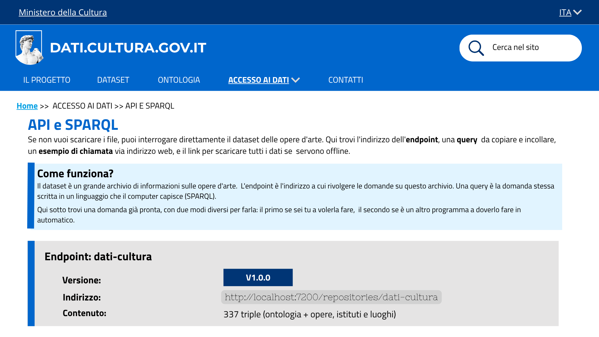
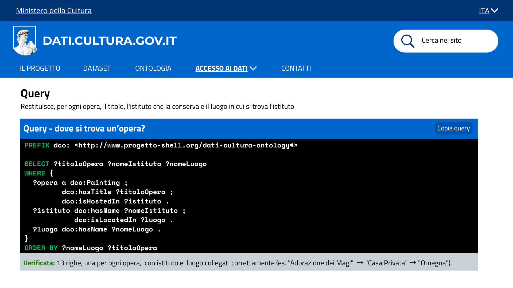
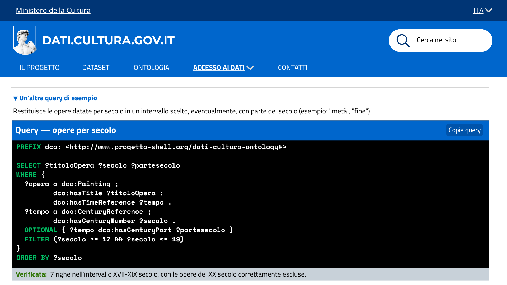
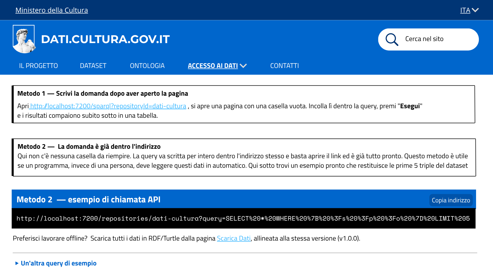

# Esposizione di API e SPARQL endpoint - US 2.6

Questa cartella documenta il mockup della pagina **API e SPARQL**, realizzato per la User Story **US2.6 - Esposizione di API e SPARQL endpoint**, nell'ambito del progetto SHELL, sotto-progetto dati.cultura.

> **Come data manager, voglio permettere agli utenti e alle applicazioni di accedere ai dati in modo programmatico, per facilitarne la consultazione e il riuso automatico.**

## Contenuto della cartella

```
Mockup/API_SPARQL/
├── README.md                      ← questo file
└── Immagini/
    ├── API_SPARQL_.png            ← pagina, vista d'insieme
    ├── API_SPARQL_Query_1.png     ← query "dove si trova un'opera?"
    ├── API_SPARQL_Query_2.png     ← query "opere per secolo" (accordion)
    └── API_SPARQL_Metodi.png      ← i due metodi + esempio di chiamata API
```

---

## 1. Vista d'insieme


La pagina spiega prima in parole semplici cosa sono endpoint e query (riquadro "Come funziona?"), poi mostra la scheda tecnica dell'endpoint: versione (v1.0.0), indirizzo (`http://localhost:7200/repositories/dati-cultura`) e contenuto (337 triple, ontologia più dati di opere, istituti e luoghi).

## 2. Una query pronta da usare


Una query SPARQL eseguibile, con pulsante "Copia query", che restituisce titolo, istituto e luogo di ogni opera. 

## 3. Un'altra query di esempio


Una seconda query, dentro un blocco a scomparsa, che restituisce le opere datate per secolo in un intervallo scelto. 

## 4. Come usare la query, e link ai dati completi


Due metodi per eseguire la query: da browser con l'editor grafico (Metodo 1), oppure con la domanda già scritta dentro l'indirizzo, utile per un programma (Metodo 2),  con un esempio di chiamata API pronto e il pulsante "Copia indirizzo". In fondo, un rimando alla pagina **Scarica Dati**, per chi preferisce lavorare offline con tutti i dati in RDF/Turtle, allineata alla stessa versione (v1.0.0).

---

## 5. Copertura del test di accettazione

| Requisito | Dove è soddisfatto |
|---|---|
| Esempio di chiamata API | Metodo 2, schermata 4 |
| Query SPARQL eseguibile | Schermate 2 e 3, entrambe verificate |
| Link al dump completo in RDF/Turtle | Rimando alla pagina Scarica Dati, schermata 4 |

---

## 6. Deliverable

- Mockup della pagina API e SPARQL, quattro schermate (`Immagini/`)

La documentazione tecnica dell'endpoint (indirizzo, repository, contenuto) è quella già scritta in **US1.4** (Sprint 2). 


---

## 7. Relazione con altre User Story

Questa cartella fa parte dell'epic **Accesso ai dati via API e SPARQL** (PM-4), la stessa di **US1.4** (Sprint 2), che aggiunge a questa base le due query di esempio e la loro verifica. Il link alla pagina "Scarica Dati" collega questa cartella a **US1.5** (Sprint 3), stessa versione del dataset (v1.0.0) ma due modi diversi di accedervi.
