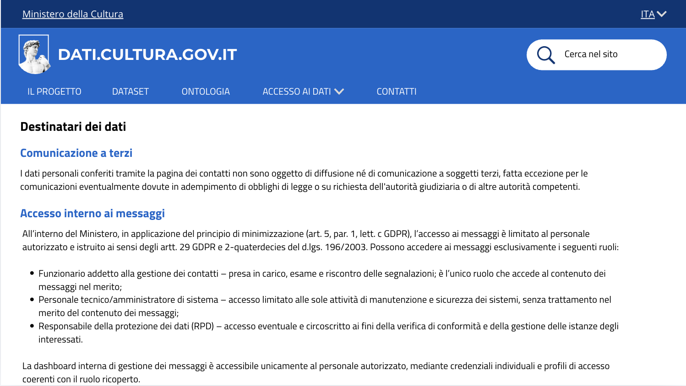

# Destinatari e accesso ai messaggi - US 3.3

Questa cartella documenta il mockup della sezione dell'informativa privacy dedicata ai destinatari dei dati, realizzato per la User Story **US3.3 - Destinatari e accesso ai messaggi**, nell'ambito del progetto SHELL, sotto-progetto dati.cultura.

> **Come funzionaria, voglio sapere quali risorse interne possono accedere ai messaggi ricevuti, per rispettare il principio di minimizzazione e gestire correttamente gli accessi.**

## Contenuto della cartella

```
Mockup/Privacy/
├── README.md                          ← questo file
└── Immagini/
    └── 06-privacy-destinatari-dati.png ← sezione "Destinatari dei dati"
```

Il testo integrale della sezione si trova invece in [`Privacy/sezione-destinatari-dati.md`](../../Privacy/): questa cartella contiene solo il mockup grafico.

---

## 1. Destinatari dei dati e accesso interno



La schermata mostra la sezione "Destinatari dei dati" dell'informativa, in continuità con la pagina già presentata per la US2.5. È articolata in due blocchi:

- **Comunicazione a terzi**: i dati personali conferiti tramite la pagina dei contatti non sono diffusi né comunicati a soggetti terzi, salvo obblighi di legge o richieste dell'autorità giudiziaria o di altre autorità competenti.
- **Accesso interno ai messaggi**: in applicazione del principio di minimizzazione (art. 5, par. 1, lett. c GDPR), l'accesso è limitato al personale autorizzato e istruito ai sensi degli artt. 29 GDPR e 2-quaterdecies del d.lgs. 196/2003. Possono accedere ai messaggi solo tre ruoli:
  - **Funzionario addetto alla gestione dei contatti**: presa in carico, esame e riscontro delle segnalazioni, è l'unico ruolo che accede al contenuto dei messaggi nel merito.
  - **Personale tecnico/amministratore di sistema**: accesso limitato alle sole attività di manutenzione e sicurezza dei sistemi, senza trattamento nel merito del contenuto.
  - **Responsabile della protezione dei dati (RPD)**: accesso eventuale e circoscritto ai fini della verifica di conformità e della gestione delle istanze degli interessati.

La dashboard interna di gestione dei messaggi è accessibile solo al personale autorizzato con credenziali individuali.

---

## 2. Copertura del test di accettazione

| Requisito | Dove è soddisfatto |
|---|---|
| L'elenco dei ruoli con accesso è dichiarato nell'informativa | Blocco "Accesso interno ai messaggi", tre ruoli elencati |
| La dashboard interna è accessibile solo al personale autorizzato | Ultimo paragrafo della sezione |

---

## 3. Deliverable

- Mockup della sezione "Destinatari dei dati", una schermata (`Immagini/`)

---

## 4. Relazione con altre User Story

Questa cartella fa parte della stessa epic di **US2.5** (Privacy e protezione dei dati personali, PM-6), insieme compongono l'informativa privacy completa del sito. US2.5 copre i dati di navigazione raccolti automaticamente dal sito mentre US3.3 copre invece l'accesso interno ai messaggi inviati dagli utenti tramite la pagina Contatti.

