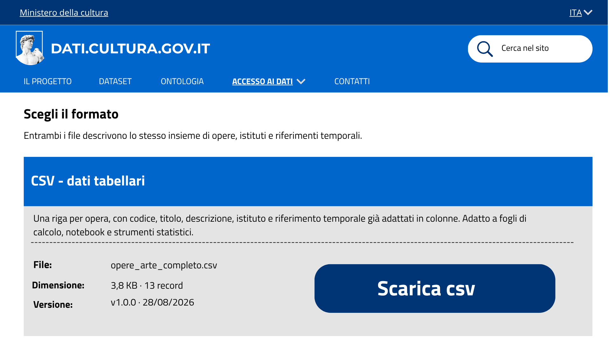
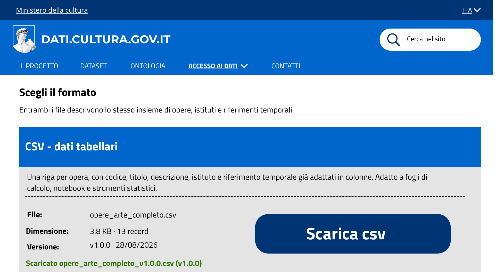
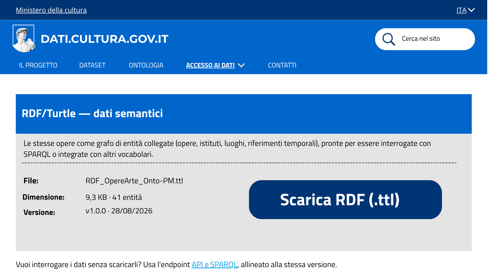
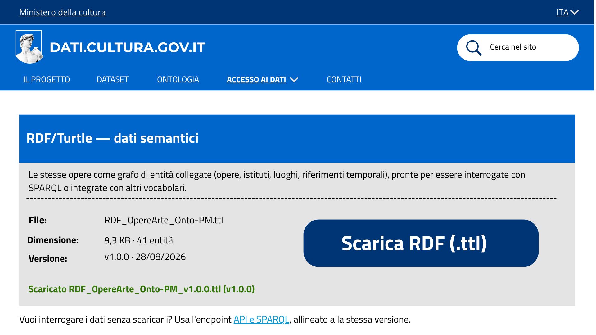

# Download dei dati - US 1.5

Questa cartella documenta il mockup della sezione **Scarica i dati**, raggiungibile dal menu a tendina Accesso ai dati, realizzata per la User Story **US1.5 - Download dei dati**, nell'ambito del progetto SHELL, sotto-progetto dati.cultura.

> **Come ricercatrice, voglio poter scaricare il dataset in formati adatti sia all'analisi tradizionale sia al riuso semantico, per lavorare sui dati offline con i miei strumenti.**

## Contenuto della cartella

```
Mockup/Scarica_dati/
├── README.md                      ← questo file
└── Immagini/
    ├── Scarica_dati_.png          ← stato del dataset
    ├── Scarica_dati_CSV_1.png     ← riquadro CSV, prima del download
    ├── Scarica_dati_CSV_2.png     ← riquadro CSV, dopo il download
    ├── Scarica_dati_RDF_1.png     ← riquadro RDF/Turtle, prima del download
    └── Scarica_dati_RDF_2.png     ← riquadro RDF/Turtle, dopo il download
```

---

## 1. Stato del dataset


Sotto il titolo, tre indicatori riassumono la dimensione del dataset: 13 opere, 11 istituti, 10 comuni. Il riquadro sottostante è la "carta d'identità" del dataset: nome, numero di versione, data di pubblicazione, ontologia di riferimento e licenza.

## 2. Scelta del formato

### CSV - dati tabellari


Il riquadro CSV descrive il file `opere_arte_completo.csv`: una riga per opera, con codice, titolo, descrizione, istituto e riferimento temporale già in colonne, pensato per fogli di calcolo e strumenti statistici. Sono indicati dimensione (3,8 KB), numero di record (13) e la versione condivisa (v1.0.0 · 28/08/2026).



Al click su "Scarica CSV", il file viene scaricato e appare una conferma testuale con il nome del file e la versione, così l'utente vede subito che il download è andato a buon fine.

### RDF/Turtle - dati semantici


Il riquadro RDF descrive il file `RDF_OpereArte_Onto-PM.ttl`: le stesse opere rappresentate come grafo di entità collegate (opere, istituti, luoghi, riferimenti temporali), pronte per essere interrogate con SPARQL. Sotto il riquadro c'è il rimando "API e SPARQL", per chi preferisce interrogare i dati senza scaricarli.



Anche qui il click su "Scarica RDF (.ttl)" avvia il download del file, con relativa conferma.

## 3. Coerenza tra i due formati

L'etichetta di versione (`v1.0.0 · 28/08/2026`) compare identica nel riquadro di stato del dataset e su entrambi i riquadri di download. Questo garantisce che CSV e RDF, anche scaricati in momenti diversi, si riferiscano sempre alla stessa versione dei dati.

---

## 4. Copertura del test di accettazione

| Requisito | Dove è soddisfatto |
|---|---|
| L'area download offre entrambi i formati (CSV e RDF/Turtle) | Sezione 2, riquadro CSV e riquadro RDF/Turtle |
| Collegati alla stessa versione del dataset | Sezione 3: etichetta `v1.0.0 · 28/08/2026` identica su stato del dataset e su entrambi i riquadri |

---

## 5. Deliverable

- Mockup della sezione Scarica i dati, cinque schermate (`Immagini/`)

---

## 6. Relazione con altre User Story

Questa cartella fa parte dell'epic **Pubblicazione del dataset opere d'arte** (PM-7). Riusa il CSV prodotto in **US2.1** (Sprint 1) e il file RDF/Turtle prodotto in **US2.3** (Sprint 2), senza produrre nuovi dati. Il rimando "API e SPARQL" collega questa pagina a **US2.6** (Sprint 3): stessa versione del dataset, due modi diversi di accedervi (scaricare i file oppure interrogarli via endpoint). 
