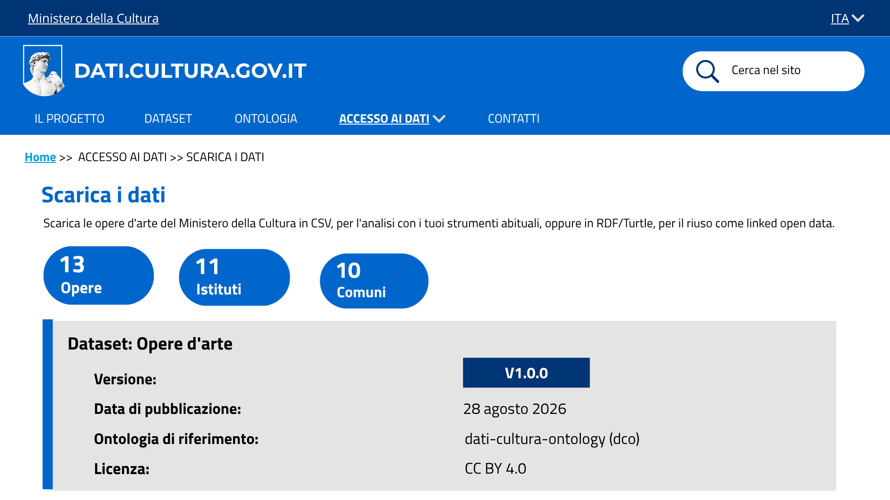
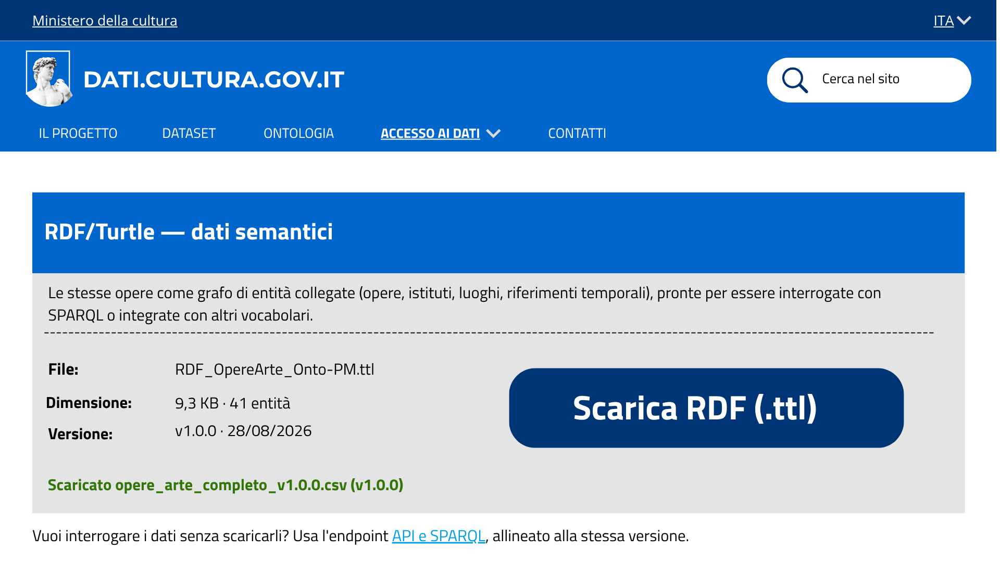

# dati.cultura.gov.it - Mockup del rifacimento del sito

## Sezione ACCESSO AI DATI › Scarica i dati - US1.5

La sezione **Scarica i dati**, raggiungibile dal menu a tendina *Accesso ai dati*, permette di scaricare il dataset delle opere d'arte in un formato adatto sia all'analisi tradizionale sia al riuso semantico. Corrisponde alla **US1.5 - Download dei dati**.

### 1.5.1 Stato del dataset

> Sotto il titolo, tre indicatori riassumono la dimensione del dataset (13 opere, 11 istituti, 10 comuni). Il riquadro sottostante è la "carta d'identità" del dataset: nome, numero di versione, data di pubblicazione, ontologia di riferimento e licenza.

### 1.5.2 Scelta del formato

**CSV - dati tabellari**

> Il riquadro CSV descrive il file `opere_arte_completo.csv`: una riga per opera, con codice, titolo, descrizione, istituto e riferimento temporale già in colonne (pensato per fogli di calcolo e strumenti statistici). Sono indicati dimensione (3,8 KB), numero di record (13) 
e la versione condivisa (v1.0.0 · 28/08/2026).

> Al click su **Scarica CSV**, il file viene scaricato e appare una conferma testuale con il nome del file scaricato e la versione, così l'utente vede subito che il download è andato a buon fine.

**RDF/Turtle - dati semantici**

>La card RDF descrive il file `RDF_OpereArte_Onto-PM.ttl`: le stesse opere rappresentate come grafo di entità collegate (opere, istituti, luoghi, riferimenti temporali), pronte per essere interrogate con SPARQL o integrate con altri vocabolari. 
Sotto il riquadro c'è il rimando **API e SPARQL** che indirizza chi preferisce interrogare i dati senza scaricarli.

> Anche qui il click su **Scarica RDF (.ttl)** avvia un download del file, con relativa conferma.

### 1.5.3 Coerenza tra i due formati

L'etichetta di versione (`v1.0.0 · 28/08/2026`) compare identica nel riquadro di stato del dataset e su entrambe le card di download. Questo garantisce che CSV e RDF, anche scaricati in momenti diversi, si riferiscano sempre alla stessa versione dei dati.
