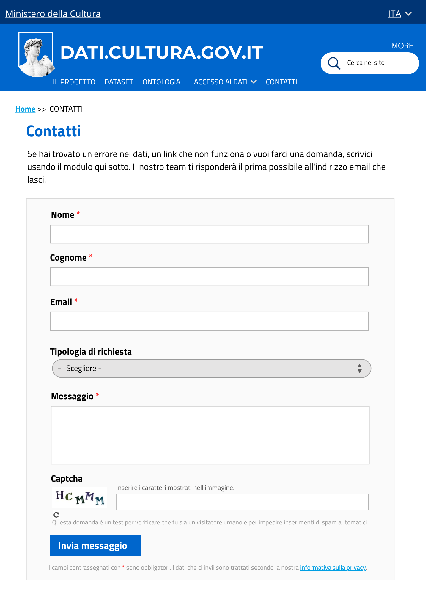
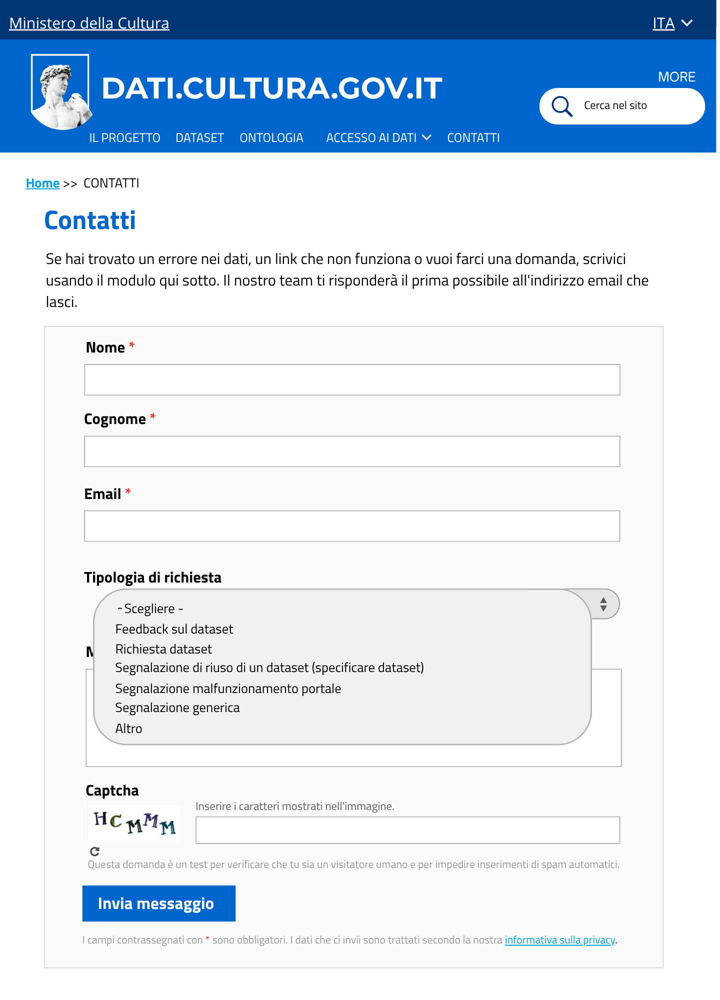
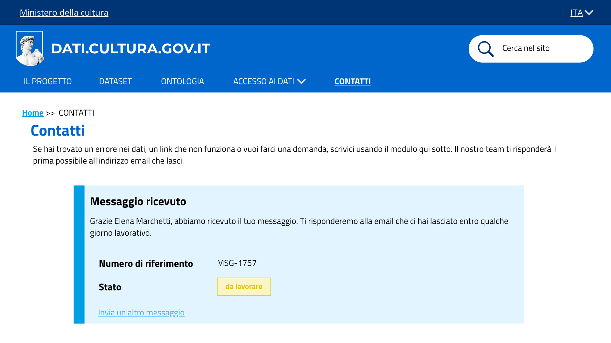

# dati.cultura.gov.it - Mockup del rifacimento del sito

Mockup a alta fedeltà, statico, della pagina **Contatti**. Le schermate mostrano l'incremento di prodotto relativo alla User Story **US1.7 - Invio di un messaggio dalla pagina contatti**: 
- il modulo di contatto,
- le sue opzioni di classificazione,
- il flusso di conferma dopo l'invio.

## Immagini/Screenshot

### 1. Modulo di contatto

Il modulo permette a chiunque visiti il sito di scrivere al Ministero senza dover creare un account. Contiene:
- i campi obbligatori **Nome**, **Cognome**, **Email** e **Messaggio**
- il campo facoltativo **Tipologia di richiesta**
- un captcha a immagine, per verificare che l'invio provenga da una persona e non da un programma automatico
- il pulsante **Invia messaggio**

### 2. Tipologia di richiesta

La tendina classifica il messaggio in ingresso tra sei opzioni: 
- **feedback su un dataset**,
- **richiesta dataset**,
- **segnalazione di riuso di un dataset**,
- **segnalazione malfunzionamento portale**,
- **segnalazione generica**
- **altro**.

### 3. Modulo compilato

Il modulo compilato con i dati della persona **Elena Marchetti**, una delle personas create per il progetto, bibliotecaria comunale che segnala un link non funzionante trovato tra le pagine Scarica Dati e API e SPARQL.

### 4. Conferma di ricezione

All'invio, l'utente riceve una conferma con:
- un messaggio personalizzato con il proprio nome e cognome
- un numero di riferimento univoco (es. `MSG-1757`)
- lo stato **da lavorare**, a indicare che il messaggio è stato preso in carico dal Ministero
