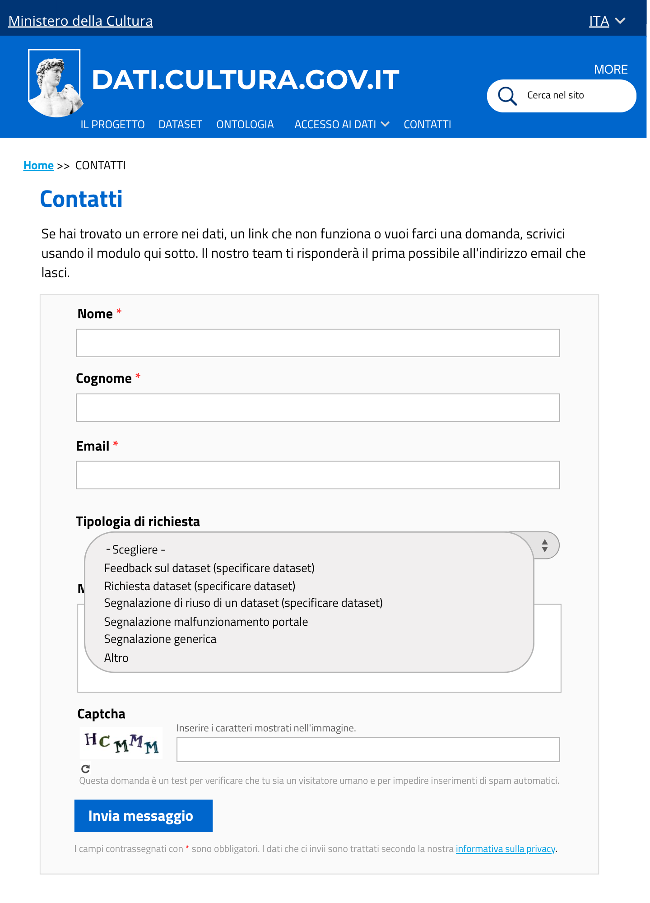
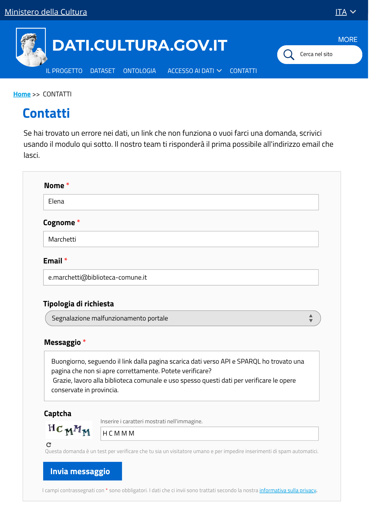

# Invio di un messaggio dalla pagina contatti - US 1.7

Mockup ad alta fedeltà, statico, della pagina **Contatti** del rifacimento del catalogo open data del Ministero della Cultura (dati.cultura.gov.it), realizzato nell'ambito del progetto SHELL (corso Metodi informatici per la trasformazione digitale, a.a. 2025/2026). Le schermate mostrano l'incremento di prodotto relativo alla User Story **US1.7 - Invio di un messaggio dalla pagina contatti**:

> **Come utente, voglio inviare un messaggio dalla pagina contatti fornendo nome, cognome ed email, per segnalare un problema al Ministero.**

## Contenuto della cartella

```
Mockup/Contatti/
├── README.md                                  ← questo file
└── Immagini/
    ├── Contatti_Vuoto.png                     ← modulo di contatto, vuoto
    ├── Contatti_Tipologia_Dropdown.png        ← tendina "Tipologia di richiesta"
    ├── Contatti_Persona_Elena_Form.png        ← modulo compilato
    └── Contatti_Persona_Elena_Conferma.png    ← conferma di ricezione
```

## Immagini/Screenshot

### 1. Modulo di contatto


Il modulo permette a chiunque visiti il sito di scrivere al Ministero senza dover creare un account. Contiene:
- i campi obbligatori **Nome**, **Cognome**, **Email** e **Messaggio**
- il campo facoltativo **Tipologia di richiesta**
- un captcha a immagine, per verificare che l'invio provenga da una persona e non da un programma automatico
- il pulsante **Invia messaggio**

### 2. Tipologia di richiesta


La tendina classifica il messaggio in ingresso tra sei opzioni:
- **feedback su un dataset**: un commento o un'osservazione su un dataset già pubblicato (es. "manca un campo", "la descrizione non è chiara");
- **richiesta dataset**: l'utente vorrebbe che venisse pubblicato un dataset che al momento non esiste nel catalogo;
- **segnalazione di riuso di un dataset**: l'utente comunica di aver usato i dati per un proprio progetto, utile al Ministero per capire come vengono usati;
- **segnalazione malfunzionamento portale**: qualcosa sul sito non funziona (es. pagina che non si carica);
- **segnalazione generica**: per tutto quello che non rientra nelle categorie sopra;
- **altro**: per messaggi che non si adattano a nessuna delle opzioni precedenti.


### 3. Modulo compilato


Il modulo compilato con i dati della persona **Elena Marchetti**, una delle personas create per il progetto, bibliotecaria comunale che segnala un link non funzionante trovato tra le pagine Scarica Dati e API e SPARQL.

### 4. Conferma di ricezione


All'invio, l'utente riceve una conferma con:
- un messaggio personalizzato con il proprio nome e cognome
- un numero di riferimento univoco (es. `MSG-1757`)
- lo stato **da lavorare**, a indicare che il messaggio è stato preso in carico dal Ministero

---

## Copertura del test di accettazione

| Requisito | Dove è soddisfatto |
|---|---|
| Il form richiede nome, cognome, email e testo del messaggio | Sezione 1, campi obbligatori |
| All'invio l'utente riceve conferma di ricezione | Sezione 4 |
| Il messaggio entra in stato "da lavorare" | Sezione 4, etichetta di stato |

---

## Deliverable

- Mockup della pagina Contatti, quattro schermate (`Immagini/Screenshot`)
---

## Relazione con altre User Story

Questa cartella fa parte dell'epic Pagina contatti e gestione dei messaggi (PM-5). Il messaggio che l'utente invia da qui è lo stesso di cui si occupano US3.1, US3.2, US3.3 e US3.4 (epic Privacy e protezione dei dati personali).
