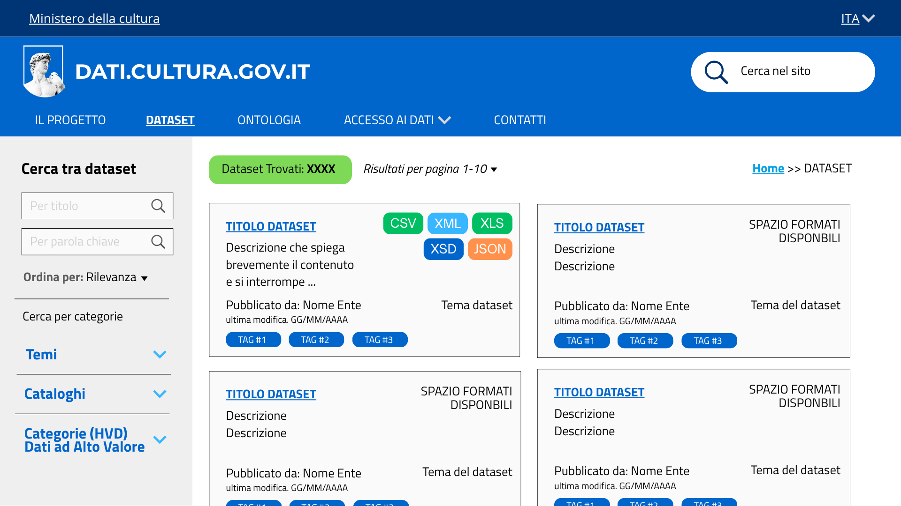
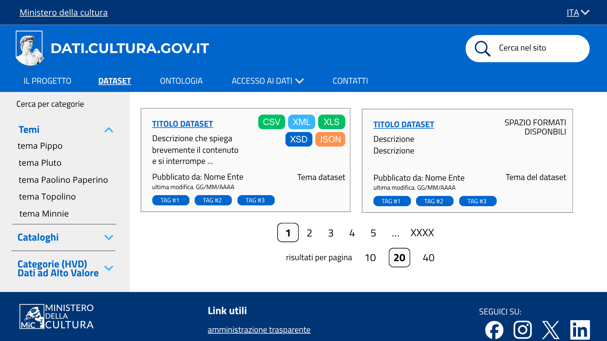

# Ricerca dataset nel catalogo - US 1.2

Questa cartella documenta il mockup della pagina "Dataset" del catalogo, realizzata per la User Story **US1.2 - Ricerca dataset nel catalogo**, nell'ambito del progetto SHELL, sotto-progetto dati.cultura.

> **Come ricercatrice, voglio cercare dataset per parola chiave o categoria, per trovare velocemente i dati sulle opere d'arte che mi interessano.**

## Contenuto della cartella

```
Mockup/Dataset/
├── README.md                      ← questo file
└── Immagini/
    ├── Dataset_head.png      ← intestazione, barra di ricerca e risultati
    └── Dataset_foot.png      ← filtri per categoria e paginazione
```

---

## 1. Intestazione, barra di ricerca e risultati



Mostra la parte superiore della pagina Dataset. Nella colonna di sinistra è presente il pannello **Cerca tra dataset** con i campi di ricerca **per titolo** e **per parola chiave**, il selettore **Ordina per** (es. Rilevanza) e l'avvio dei filtri **Cerca per categorie** (Temi, Cataloghi, Categorie HVD - Dati ad Alto Valore). Nell'area centrale, in alto, sono indicati il numero di **Dataset trovati**, il selettore dei **risultati per pagina** e il percorso di navigazione (Home >> Dataset). Sotto sono elencate le schede dei dataset: ciascuna riporta titolo, breve descrizione, i **formati disponibili** (badge CSV, XML, XLS, XSD, JSON), l'ente che ha pubblicato il dataset, la data di ultima modifica, il tema e alcuni tag.

## 2. Filtri per categoria e paginazione



Mostra la parte inferiore della stessa pagina. Nel pannello di sinistra il filtro **Temi** è espanso, con l'elenco dei temi selezionabili, seguito dai filtri **Cataloghi** e **Categorie (HVD)**. Nell'area centrale prosegue l'elenco delle schede dei dataset. In basso è presente la **paginazione** dei risultati (pagine 1, 2, 3 ... con l'ultima pagina) e il selettore del numero di **risultati per pagina** (10, 20, 40). Chiude la schermata il footer del sito con logo, link utili e collegamenti social, coerente con le altre pagine.

---

## 3. Copertura del test di accettazione

| Requisito (dalla Descrizione) | Dove è soddisfatto |
|---|---|
| Cercare dataset per parola chiave | Campo "per parola chiave" nel pannello "Cerca tra dataset", schermata 1 |
| Cercare/filtrare dataset per categoria | Filtri "Cerca per categorie" (Temi, Cataloghi, Categorie HVD), schermate 1 e 2 |

---

## 4. Deliverable

- Mockup della pagina Dataset, due schermate (`Immagini/`)

---

## 5. Relazione con altre User Story

Questa cartella fa parte dell'epic **Catalogo dati e ricerca dataset** (PM-2), la stessa di **US1.11** (Formato visibile nella sezione dataset). 
