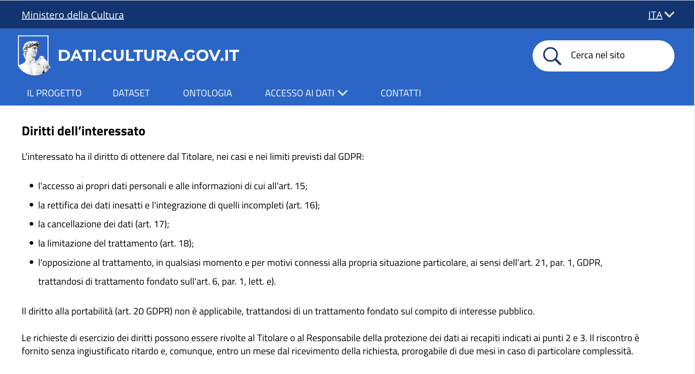

# Cancellazione su richiesta dell'interessato - US 3.4

Questa cartella documenta la sezione dell'informativa privacy sui diritti dell'interessato, realizzata per la User Story **US3.4 - Cancellazione su richiesta dell'interessato**, nell'ambito del progetto SHELL, sotto-progetto dati.cultura.

> **Come funzionaria, voglio sapere come cancellare i dati di un utente che ne fa richiesta, per gestire correttamente l'esercizio dei suoi diritti.**

## Contenuto della cartella

```
Mockup/Privacy/DirittiInteressato/
├── README.md                          ← questo file
└── Immagini/
    └── 09-diritti-interessato.png     ← sezione "Diritti dell'interessato"
```
---

## 1. Diritti dell'interessato



La sezione dell'informativa che elenca i diritti dell'interessato è mostrata in un'unica schermata. Elenca cinque diritti esercitabili, ciascuno con il riferimento all'articolo GDPR corrispondente: **accesso** (art. 15), **rettifica** (art. 16), **cancellazione** (art. 17), **limitazione del trattamento** (art. 18) e **opposizione** (art. 21, par. 1). Precisa che il diritto alla **portabilità** (art. 20) non è applicabile, trattandosi di un trattamento fondato sul compito di interesse pubblico (art. 6, par. 1, lett. e , la stessa base giuridica già motivata in US2.5).

Indica infine le modalità di esercizio: la richiesta va rivolta al **Titolare** o al **Responsabile della protezione dei dati**, con riscontro fornito senza ingiustificato ritardo e comunque entro un mese dal ricevimento, prorogabile di due mesi in caso di particolare complessità.

---

## 2. Copertura del test di accettazione

| Requisito | Dove è soddisfatto |
|---|---|
| La procedura è documentata con tempi di risposta definiti | [`procedura-interna-cancellazione-dati.md`](../../../Privacy/procedura-interna-cancellazione-dati.md), in `Privacy/` |
| L'informativa elenca tutti i diritti dell'interessato | Schermata, cinque diritti elencati (accesso, rettifica, cancellazione, limitazione, opposizione) |
| Le modalità di esercizio | Schermata, richiesta al Titolare/RPD con riscontro entro un mese, prorogabile di due mesi |

---

## 3. Deliverable

- Mockup della sezione "Diritti dell'interessato", una schermata (`Immagini/`)
- Procedura interna di cancellazione dei dati, in [`Privacy/procedura-interna-cancellazione-dati.md`](../../../Privacy/)

---

## 4. Relazione con altre User Story
Questa cartella fa parte della stessa epic di US2.5, US3.1, US3.2 e US3.3 (Privacy e protezione dei dati personali, PM-6). La base giuridica (compito di interesse pubblico, art. 6 par. 1 lett. e GDPR) è la stessa già spiegata in US2.5, qui vediamo cosa comporta in pratica per i diritti dell'interessato.
