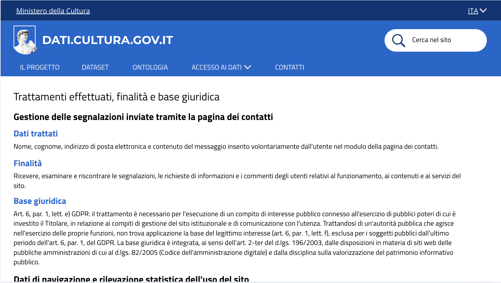

# Base giuridica del trattamento dei messaggi - US 3.2

Questa cartella documenta la sezione dell'informativa privacy sulla base giuridica del trattamento dei messaggi, realizzata per la User Story **US3.2 - Base giuridica del trattamento dei messaggi**, nell'ambito del progetto SHELL, sotto-progetto dati.cultura.

> **Come funzionaria, voglio sapere su quale base è possibile trattare i dati contenuti nei messaggi, per gestire correttamente le richieste degli utenti e fornire informazioni chiare.**

## Contenuto della cartella

```
Mockup/Privacy/GestioneSegnalazioni/
├── README.md                                          ← questo file
└── Immagini/
    └── 08-gestione-segnalazioni-contatti.png          ← sezione "Trattamenti effettuati, finalità e base giuridica"
```
---

## 1. Gestione delle segnalazioni inviate tramite la pagina dei contatti



La sezione relativa al trattamento dei dati conferiti tramite la pagina dei contatti è mostrata in un'unica schermata. Questo muckup conclude la sezione "Trattamenti effettuati, finalità e base giuridica" già avviata con la sezione "Dati di navigazione e rilevazione statistica dell'uso del sito" di **US2.5**, completandola con il trattamento dei dati conferiti tramite la pagina dei contatti. 
È articolata in tre parti:

- **Dati trattati**: nome, cognome, indirizzo di posta elettronica e contenuto del messaggio, inseriti volontariamente dall'utente nel modulo della pagina dei contatti.
- **Finalità**: ricevere, esaminare e riscontrare le segnalazioni, le richieste di informazioni e i commenti degli utenti relativi al funzionamento, ai contenuti e ai servizi del sito.
- **Base giuridica**: art. 6, par. 1, lett. e) GDPR, il trattamento serve a svolgere un compito di interesse pubblico, legato alla gestione del sito e alla comunicazione con i cittadini. Non si usa il legittimo interesse (art. 6.1.f), perché non vale per gli enti pubblici. La base è confermata anche da altre norme italiane: art. 2-ter del d.lgs. 196/2003 e Codice dell'amministrazione digitale (d.lgs. 82/2005).
---

## 2. Copertura del test di accettazione

| Requisito | Dove è soddisfatto |
|---|---|
| La base giuridica è esplicitata nell'informativa | Blocco "Base giuridica" nella schermata (sezione 1) |
| È motivata coerentemente con la natura pubblica del titolare | Esclusione del legittimo interesse e fondamento normativo, nella schermata |

---

## 3. Deliverable

- Mockup della sezione "Gestione delle segnalazioni", una schermata (`Immagini/`)

---

## 4. Relazione con altre User Story

Questa cartella fa parte della stessa epic di **US2.5**, **US3.1**, **US3.3** e **US3.4** (Privacy e protezione dei dati personali, PM-6). Completa la sezione "Trattamenti effettuati, finalità e base giuridica" avviata in US2.5 per i dati di navigazione, aggiungendo qui il trattamento dei dati conferiti tramite la pagina Contatti.
