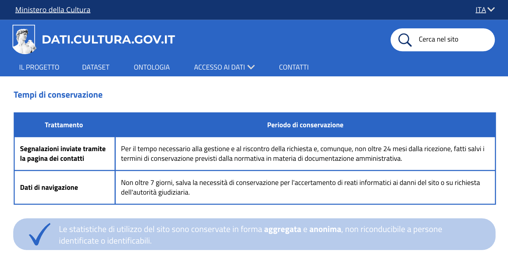

# Tempi di conservazione dei messaggi - US 3.1

Questa cartella documenta la sezione dell'informativa privacy sui tempi di conservazione, realizzata per la User Story **US3.1 - Tempi di conservazione dei messaggi**, nell'ambito del progetto SHELL, sotto-progetto dati.cultura.

> **Come funzionaria, voglio sapere per quanto tempo devono essere conservati i messaggi ricevuti, per gestirli in modo coerente e rispettare i principi di protezione dei dati.**

## Contenuto della cartella

```
Mockup/Privacy/TempiConservazione/
├── README.md                          ← questo file
└── Immagini/
    └── 07-tempi-conservazione.png     ← sezione "Tempi di conservazione"
```

---

## 1. Tempi di conservazione



La sezione dell'informativa dedicata ai tempi di conservazione è mostrata in un'unica schermata. Questa schermata integra e completa il mockup della sezione tempi di conservazione già avviato con la US2.5. È stata aggiunta la riga relativa alle segnalazioni inviate tramite la pagina dei contatti, portando così la tabella alla sua versione completa con entrambi i trattamenti.

La tabella mostra:
- **Segnalazioni inviate tramite la pagina dei contatti**: conservate per il tempo necessario alla gestione e al riscontro della richiesta e, non oltre 24 mesi dalla ricezione, fatti salvi i termini di conservazione previsti dalla normativa in materia di documentazione amministrativa.
- **Dati di navigazione**: non oltre 7 giorni, salva la necessità di conservazione per l'accertamento di reati informatici ai danni del sito o su richiesta dell'autorità giudiziaria.

---

## 2. Copertura del test di accettazione

| Trattamento | Periodo dichiarato | Eccezioni |
|---|---|---|
| Segnalazioni inviate tramite la pagina dei contatti | Per il tempo necessario alla gestione e al riscontro, comunque non oltre 24 mesi | Fatti salvi i termini previsti dalla normativa in materia di documentazione amministrativa |
| Dati di navigazione | Non oltre 7 giorni | Salva la necessità di conservazione per l'accertamento di reati informatici ai danni del sito o su richiesta dell'autorità giudiziaria |

---

## 3. Deliverable

- Mockup della sezione "Tempi di conservazione", una schermata (`Immagini/`)

---

## 4. Relazione con altre User Story

Questa cartella fa parte della stessa epic di **US2.5**, **US3.2**, **US3.3** e **US3.4** (Privacy e protezione dei dati personali, PM-6). Completa la tabella dei tempi di conservazione avviata in US2.5.
